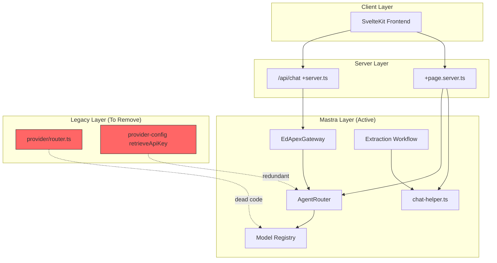
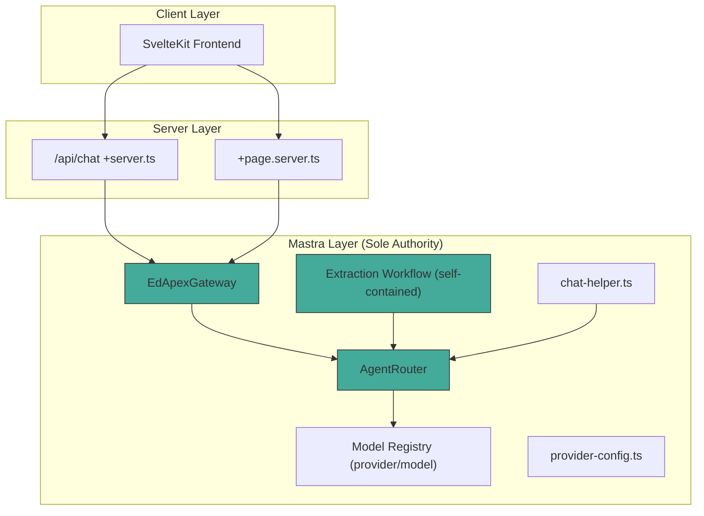
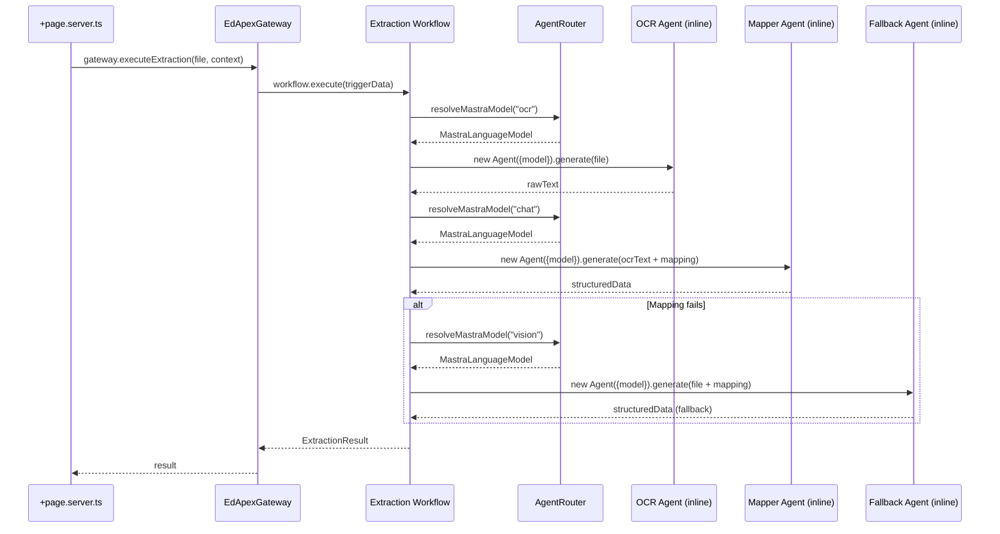
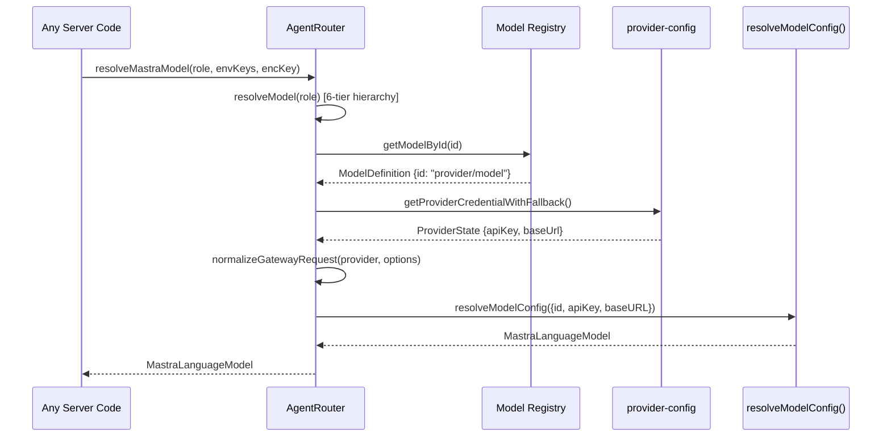

# Design Document: Mastra-Native Backend Migration

## Overview

This feature completes the migration of EdApex's backend AI operations to Mastra-native `agent.generate()` / `agent.stream()` calls by eliminating the legacy AI SDK provider layer. The system already uses Mastra for its core Gateway, AgentRouter, and chat-helper functions. What remains is: migrating model ID formats from `provider:model` to `provider/model`, deleting the legacy `provider/router.ts`, making the extraction workflow self-contained, cleaning up `+page.server.ts` to use the Gateway/workflow, removing the redundant `retrieveApiKey()` wrapper, and replacing all `generateId` imports from the `"ai"` package with `crypto.randomUUID()`.

The end state is a codebase where the only AI framework dependency is `@mastra/core` on the server side, with `"ai"` imports limited to the client-side chat transport layer (`@ai-sdk/svelte`, `createUIMessageStream`).

## Architecture

### Current State (Before Migration)



### Target State (After Migration)



## Sequence Diagrams

### Document Extraction Flow (Self-Contained Workflow)



### Model Resolution Flow (Unified)



## Components and Interfaces

### Component 1: Model Registry (`registry.ts`)

**Purpose**: Single source of truth for all available model definitions with native Mastra ID format.

**Interface**:
```typescript
interface ModelDefinition {
  id: string;           // Format: "provider/model-name" (Mastra-native)
  name: string;
  provider: string;
  description: string;
  tier: 'flagship' | 'pro' | 'mid' | 'speed' | 'lite' | 'reasoning' | 'omni' | 'low';
  classification: 'strong' | 'balanced' | 'simple';
  contextWindow: number;
  maxOutputTokens: number;
  capabilities: {
    supportsReasoning: boolean;
    supportsVision: boolean;
    supportsTools: boolean;
  };
}

// Lookup functions
function getModelById(id: string): ModelDefinition | undefined;
function getModelsByProvider(provider: string): ModelDefinition[];
function getBareModelName(id: string): string; // "opengateway/mimo-v2-flash" → "mimo-v2-flash"
```

**Responsibilities**:
- Store all model definitions with `provider/model` format IDs
- Provide lookup by ID, provider, classification, and capability
- Extract bare model names for API calls

### Component 2: AgentRouter (`router.ts`)

**Purpose**: 6-tier model resolution hierarchy returning live `MastraLanguageModel` instances.

**Interface**:
```typescript
interface ResolvedModel {
  provider: string;
  model: string;       // Full ID: "provider/model-name"
  apiKey?: string;
  baseUrl?: string;
  capabilities?: ModelDefinition['capabilities'];
}

class AgentRouter {
  constructor(db: LibSQLDatabase, userId: number);

  // Primary API — returns a ready-to-use model
  resolveMastraModel(
    roleOrTask: AgentRole | TaskType,
    envKeys: Record<string, string | undefined>,
    encryptionKey: string,
    conversationOverride?: string,
    thinkingEnabled?: boolean,
    profileOverride?: string
  ): Promise<MastraLanguageModel>;

  // Internal — returns metadata without instantiation
  resolveModel(
    role: AgentRole,
    conversationOverride?: string,
    thinkingEnabled?: boolean,
    profileOverride?: string
  ): Promise<ResolvedModel>;
}
```

**Responsibilities**:
- Resolve models through the 6-tier hierarchy (conversation override → deep reasoning → role mapping → profile → thinking → global fallback)
- Inject credentials via `provider-config.ts`
- Return live `MastraLanguageModel` instances ready for `agent.generate()` / `agent.stream()`
- Eliminate `toMastraModelId()` conversion (IDs are already native format)

### Component 3: Extraction Workflow (`workflows/extraction.ts`)

**Purpose**: Self-contained 3-step Mastra workflow for document OCR and structured data extraction.

**Interface**:
```typescript
// Trigger schema
interface ExtractionTrigger {
  files: Array<{ fileId: string; blob: Blob; mediaType: string }>;
  userId: number;
  teacherId: number;
  classId: number;
  sectionId: number;
  tenantContext: { schoolId: number };
}

// Workflow output
interface ExtractionOutput {
  suspended: boolean;
  resultCount: number;
  errors: string[];
}

// The workflow itself
const extractionWorkflow: Workflow<ExtractionTrigger, ExtractionOutput>;
```

**Responsibilities**:
- Create inline OCR, Mapper, and Fallback agents within workflow steps
- Use `AgentRouter.resolveMastraModel()` directly for model resolution
- No dependency on `chat-helper.ts` for extraction logic
- Suspend for human validation after extraction

### Component 4: provider-config.ts (Cleaned)

**Purpose**: Encryption, credential storage, and transport normalization for provider API keys.

**Interface**:
```typescript
// Retained functions
function encrypt(text: string, encryptionKey: string): string;
function decrypt(encryptedText: string, encryptionKey: string): string;
function maskKey(key: string): string;
function normalizeGatewayRequest(provider: string, options: any): any;
function ensureAgentTables(db: LibSQLDatabase): Promise<void>;
function saveProviderCredential(db, config): Promise<void>;
function getProviderCredentialWithFallback(db, userId, provider, envKeys): Promise<ProviderState | null>;
function getAllActiveProviders(db, userId, envKeys, supportedProviders): Promise<ProviderState[]>;
function deleteProviderCredential(db, userId, provider): Promise<void>;

// REMOVED: retrieveApiKey() — redundant with AgentRouter.resolveMastraModel()
```

**Responsibilities**:
- AES-256-CBC encryption/decryption of API keys
- DB-first credential lookup with env fallback
- Transport normalization for OpenGateway and OpenCode providers
- Schema migration for agent tables

## Data Models

### Model ID Format Migration

**Before** (legacy `provider:model`):
```typescript
// registry.ts entries
{ id: 'opengateway:mimo-v2-flash', provider: 'opengateway', ... }
{ id: 'groq:llama-3.3-70b-versatile', provider: 'groq', ... }
{ id: 'mistral:mistral-ocr-latest', provider: 'mistral', ... }
{ id: 'nvidia:minimaxai/minimax-m2.7', provider: 'nvidia', ... }
```

**After** (Mastra-native `provider/model`):
```typescript
// registry.ts entries
{ id: 'opengateway/mimo-v2-flash', provider: 'opengateway', ... }
{ id: 'groq/llama-3.3-70b-versatile', provider: 'groq', ... }
{ id: 'mistral/mistral-ocr-latest', provider: 'mistral', ... }
{ id: 'nvidia/minimaxai/minimax-m2.7', provider: 'nvidia', ... }
```

**Validation Rules**:
- All IDs must contain exactly one `/` separating provider from model name (except NVIDIA NIM models which have nested paths like `nvidia/minimaxai/minimax-m2.7`)
- Provider prefix must match the `provider` field
- No `:` characters allowed in model IDs

### ID Generation Replacement

**Before**:
```typescript
import { generateId } from "ai";
const id = generateId(); // Returns nanoid-style string
```

**After**:
```typescript
import { randomUUID } from "crypto";
const id = randomUUID(); // Returns UUID v4 string
```

**Impact**: Session IDs and chat thread IDs will be UUID format instead of nanoid. This is safe because:
- IDs are opaque strings used as primary keys
- No code depends on ID format/length
- UUID provides stronger uniqueness guarantees

## Key Functions with Formal Specifications

### Function 1: `getBareModelName(id: string): string`

```typescript
function getBareModelName(id: string): string {
  const slashIndex = id.indexOf('/');
  return slashIndex === -1 ? id : id.slice(slashIndex + 1);
}
```

**Preconditions:**
- `id` is a non-empty string
- `id` follows the format `provider/model-name`

**Postconditions:**
- Returns the model name portion after the first `/`
- If no `/` exists, returns the full string unchanged
- Never returns an empty string (given non-empty input)

### Function 2: `AgentRouter.resolveMastraModel()` (simplified)

```typescript
async resolveMastraModel(
  roleOrTask: AgentRole | TaskType,
  envKeys: Record<string, string | undefined>,
  encryptionKey: string,
  conversationOverride?: string,
  thinkingEnabled?: boolean,
  profileOverride?: string
): Promise<MastraLanguageModel> {
  const resolved = await this.resolveModel(roleOrTask, conversationOverride, thinkingEnabled, profileOverride);
  const config = await getProviderCredentialWithFallback(this.db, this.userId, resolved.provider, envKeys);
  
  const apiKey = resolveApiKeyFromConfig(config, envKeys, resolved.provider, encryptionKey);
  const bareModel = getBareModelName(resolved.model);

  const baseOptions = {
    id: resolved.model as `${string}/${string}`,  // Already in provider/model format
    apiKey,
    baseURL: config?.baseUrl || undefined,
  };

  const normalized = normalizeGatewayRequest(resolved.provider, baseOptions);
  return await resolveModelConfig(normalized) as MastraLanguageModel;
}
```

**Preconditions:**
- `this.db` is a valid LibSQLDatabase connection
- `this.userId` is a positive integer
- `envKeys` contains environment variables (may be empty)
- `encryptionKey` is a non-empty string

**Postconditions:**
- Returns a valid `MastraLanguageModel` instance
- The model ID passed to `resolveModelConfig` is in `provider/model` format
- API key is decrypted if stored in DB, or read from env
- Throws if no provider credential is found and provider is not `opengateway`

### Function 3: Extraction Workflow `extractStep` (self-contained)

```typescript
const extractStep = createStep({
  id: "extract-files",
  execute: async ({ inputData }) => {
    const { files, userId, teacherId, classId, sectionId } = inputData;
    const { env } = await import("$env/dynamic/private");
    const db = createMastraDb();
    const router = new AgentRouter(db, userId);
    const encryptionKey = env.TOKEN_ENCRYPTION_KEY || "edapex-default-encryption-key-32ch";
    const envKeys = env as Record<string, string | undefined>;

    // Resolve models inline
    const ocrModel = await router.resolveMastraModel("ocr", envKeys, encryptionKey);
    const mapperModel = await router.resolveMastraModel("chat", envKeys, encryptionKey);
    const fallbackModel = await router.resolveMastraModel("vision", envKeys, encryptionKey);

    // Create inline agents
    const ocrAgent = new Agent({ id: "ocr-agent", model: ocrModel, instructions: OCR_SYSTEM_PROMPT });
    const mapperAgent = new Agent({ id: "mapper-agent", model: mapperModel, instructions: MAPPER_SYSTEM_PROMPT });

    // Execute two-pass extraction per file...
  }
});
```

**Preconditions:**
- `inputData` passes `extractionTriggerSchema` validation
- Environment variables are accessible
- At least one file is provided

**Postconditions:**
- Each file is processed through OCR → Mapping pipeline
- Failed OCR attempts fall back to single-pass vision extraction
- Returns structured data array with per-file results and error list
- No external dependency on `chat-helper.ts`

## Example Usage

### Using the Gateway (primary path for chat)

```typescript
// src/routes/api/chat/+server.ts — already correct, no changes needed
const gateway = new EdApexGateway(mastraDb, user.id, env.ENCRYPTION_KEY, envKeys);
const result = await gateway.stream(promptText, tenantContext, { threadId: chatId });
```

### Using AgentRouter directly (for specific tasks)

```typescript
// Title generation, extraction, or any task-specific agent
const db = createMastraDb();
const router = new AgentRouter(db, userId);
const model = await router.resolveMastraModel("title", envKeys, encryptionKey);

const agent = new Agent({ id: "title-agent", model, instructions: "..." });
const result = await agent.generate(message);
```

### Replacing generateId

```typescript
// Before
import { generateId } from "ai";
const chatId = generateId();

// After
import { randomUUID } from "crypto";
const chatId = randomUUID();
```

### +page.server.ts extraction (migrated to Gateway)

```typescript
// Before: manual AgentRouter + generateContent()
const router = new AgentRouter(db, user.id);
const visionModel = await router.resolveMastraModel("vision", envKeys, encryptionKey);
const { success, content } = await generateContent(file, visionModel, mapString);

// After: delegate to Gateway or extraction workflow
const gateway = new EdApexGateway(mastraDb, user.id, env.ENCRYPTION_KEY, envKeys);
const result = await gateway.executeExtraction(file, tenantContext, { teacherId: staffId });
```

## Error Handling

### Error Scenario 1: No Provider Credentials Available

**Condition**: `getProviderCredentialWithFallback()` returns null for a non-opengateway provider
**Response**: `AgentRouter.resolveMastraModel()` throws with descriptive error message
**Recovery**: Falls through to `opengateway` as global fallback (tier 6) which is keyless

### Error Scenario 2: OCR Pass Failure in Extraction

**Condition**: OCR agent throws during transcription
**Response**: Workflow catches error, logs warning, invokes fallback vision agent
**Recovery**: Single-pass vision extraction produces structured data directly from image

### Error Scenario 3: All Extraction Attempts Fail

**Condition**: Both two-pass and fallback extraction throw
**Response**: Error is collected in the `errors` array for that file
**Recovery**: Workflow continues processing remaining files; errors surfaced to user

### Error Scenario 4: Model ID Not Found in Registry

**Condition**: `getModelById()` returns undefined for a conversation override
**Response**: Router skips that tier and falls through to next resolution tier
**Recovery**: Eventually reaches profile-based resolution or global fallback

## Testing Strategy

### Unit Testing Approach

- Test `getBareModelName()` with various ID formats
- Test model registry lookups after format migration
- Test `normalizeGatewayRequest()` transport normalization
- Test credential resolution with mock DB and env keys
- Verify `toMastraModelId()` removal doesn't break any callers

### Property-Based Testing Approach

**Property Test Library**: fast-check (TypeScript)

Properties will focus on:
- Model ID format invariants (all IDs contain `/`, provider prefix matches)
- Round-trip consistency of model resolution
- Registry lookup correctness after migration

### Integration Testing Approach

- `pnpm run check` — Zero TypeScript errors after migration
- `grep -r "from [\"']ai[\"']" src/lib/server/` — Only `+server.ts` (for `createUIMessageStream`) remains
- Verify extraction workflow executes end-to-end with mock models
- Verify `+page.server.ts` form action works through Gateway

## Performance Considerations

- No performance impact expected — this is a code organization change, not a runtime change
- Model resolution path remains identical (6-tier hierarchy)
- Removing the legacy router eliminates dead code paths that were never called in production
- UUID generation (`crypto.randomUUID()`) is marginally faster than nanoid from the `ai` package

## Security Considerations

- API key handling remains unchanged (AES-256-CBC encryption at rest, decrypted only at call time)
- Tenant isolation preserved — all agents bound to `userId` and `TenantContext`
- Confidence gating for mutations (90% threshold) unchanged in Gateway
- No new attack surface introduced

## Dependencies

- `@mastra/core` — Agent, resolveModelConfig, createTool, createWorkflow, createStep
- `@mastra/core/llm` — resolveModelConfig, LanguageModel type
- `drizzle-orm` / `drizzle-orm/libsql` — Database access
- `crypto` (Node.js built-in) — replaces `generateId` from "ai"
- `ai` package — retained ONLY for client-side: `createUIMessageStream`, `createUIMessageStreamResponse`, `@ai-sdk/svelte`

## Correctness Properties

*A property is a characteristic or behavior that should hold true across all valid executions of a system — essentially, a formal statement about what the system should do. Properties serve as the bridge between human-readable specifications and machine-verifiable correctness guarantees.*

### Property 1: Model ID Format Invariant

*For any* model definition in the Model Registry, the `id` field must: (a) start with the `provider` field followed by a `/` character, (b) not contain any `:` characters, and (c) have the substring before the first `/` exactly equal the `provider` field.

**Validates: Requirements 1.1, 1.3, 1.4**

### Property 2: Model Resolution Determinism

*For any* given (userId, role, conversationOverride, thinkingEnabled, profile) tuple with a fixed database state, calling `resolveModel()` twice must return the same `ResolvedModel` both times.

**Validates: Requirements 8.1**

### Property 3: Bare Model Name Extraction

*For any* non-empty string input, `getBareModelName(id)` must: (a) return the portion after the first `/` if the input contains a `/`, (b) return the full input unchanged if no `/` is present, and (c) never return an empty string.

**Validates: Requirements 9.1, 9.2, 9.3**

### Property 4: No Legacy AI SDK Imports in Server Code

*For all* TypeScript files under `src/lib/server/`, no file shall import `generateId`, `generateText`, `generateObject`, `createOpenAICompatible`, `createMistral`, or the `Provider` type from the `"ai"` package or `@ai-sdk/*` packages. The only permitted `"ai"` import in server code is `createUIMessageStream` / `createUIMessageStreamResponse` in the API route handler.

**Validates: Requirements 2.3, 2.4, 2.5, 6.1, 7.1, 7.3**

### Property 5: Extraction Workflow Self-Containment

*For any* execution of the extraction workflow, the workflow module must not import `runTwoPassExtraction` or `generateContent` from `chat-helper.ts`, and must resolve its own models via `AgentRouter.resolveMastraModel()` directly.

**Validates: Requirements 3.1, 3.3**
