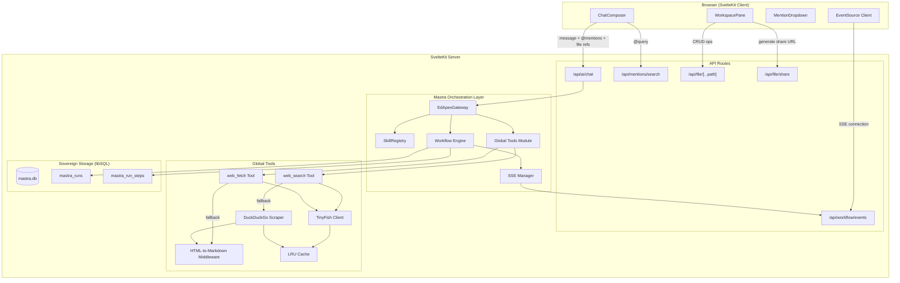
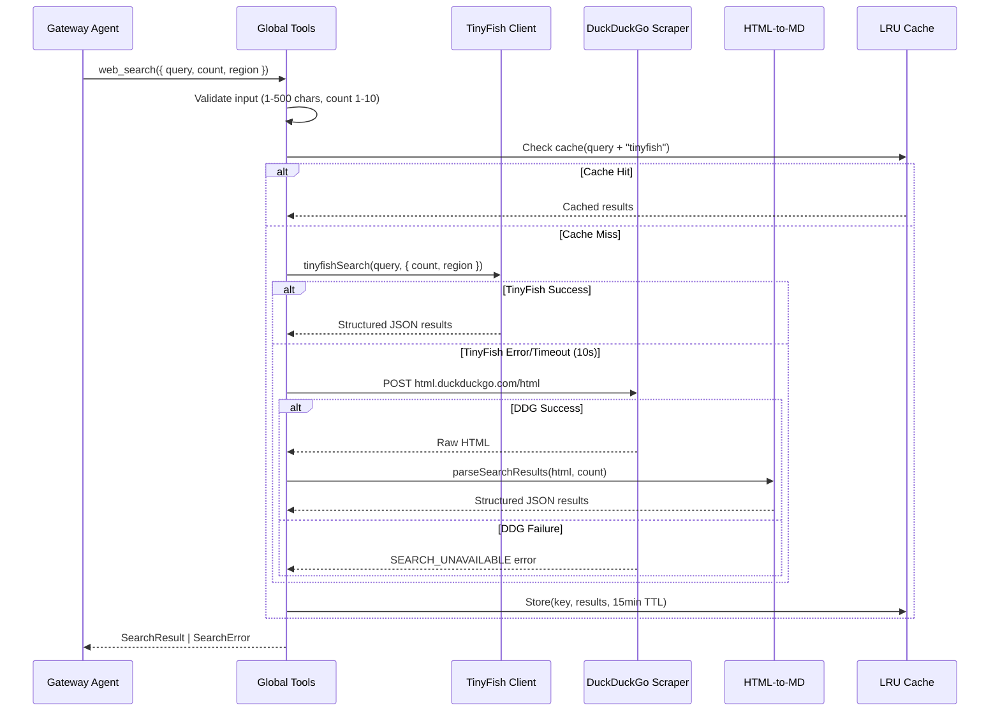
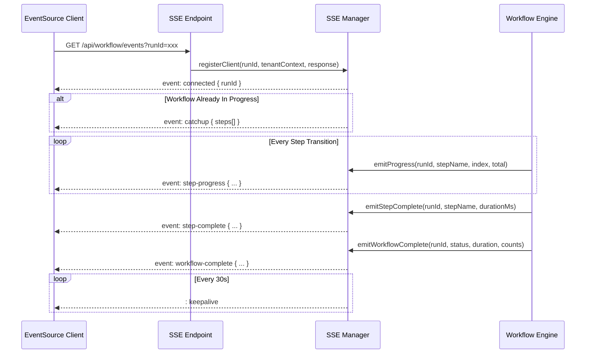
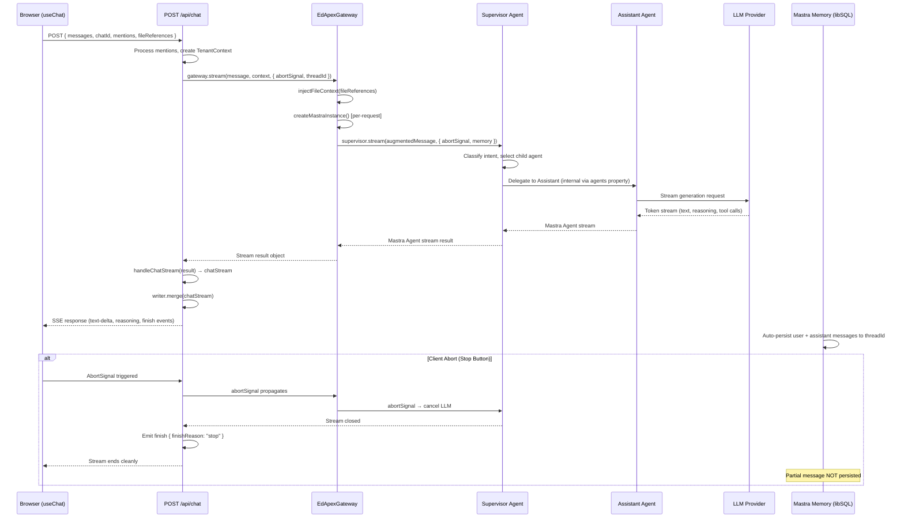
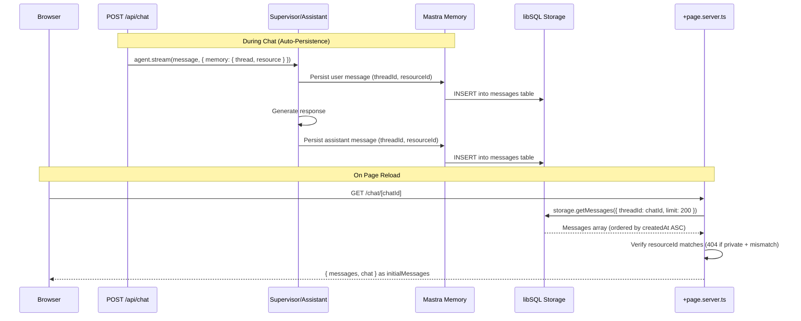
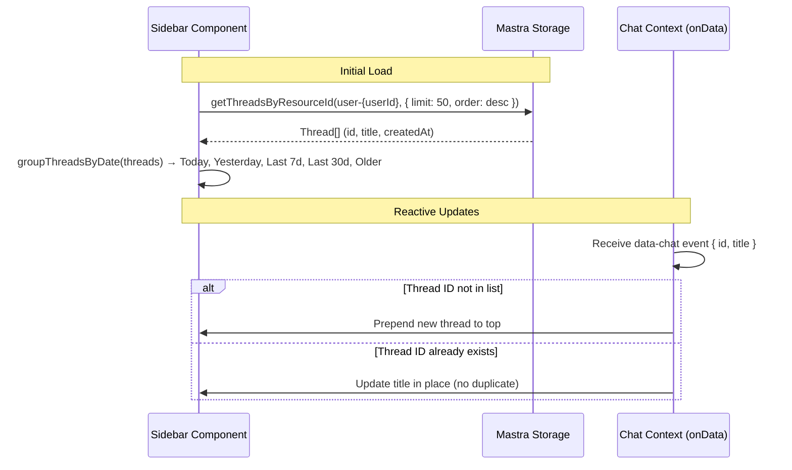

# Design Document: Mastra Orchestration Finalization

## Overview

This design finalizes the EdApex Mastra orchestration migration by implementing ten interconnected subsystems within the existing modular monolith (SvelteKit + Mastra AI Framework):

1. **Global Tools** — `web_search` and `web_fetch` as always-available Mastra `createTool` definitions with TinyFish primary / DuckDuckGo+HTTP fallback chain
2. **HTML-to-Markdown Middleware** — Lightweight server-side pipeline for token-efficient content extraction
3. **SSE Mechanism** — Server-Sent Events endpoint for real-time workflow status push to the browser
4. **Workspace Panel Extensions** — Extraction Inspector, Publish Viewer, Run History views, file-as-context hover button, and file sharing
5. **@Mention System Redesign** — Category-based entity resolution with server-side search, keyboard navigation, and role-scoped context switching
6. **Mastra Native Supervisor Pattern** — Refactor Gateway to use Mastra's native supervisor pattern with `agents` property, replacing the manual two-step orchestration
7. **Streaming Adapter (handleChatStream)** — Replace manual fullStream reader loop with `handleChatStream` from `@mastra/ai-sdk` for proper stream bridging
8. **AbortSignal Propagation** — End-to-end abort signal support from HTTP request through supervisor to child agents for client-initiated cancellation
9. **Message Persistence & Storage** — Mastra Memory auto-persistence via native thread system, centralized libSQL storage at Mastra instance level, page server retrieval
10. **Sidebar Chat History & Navigation Fix** — Thread listing from Mastra storage with reactive updates, and duplicate `goto()` prevention after `replaceState`

All subsystems operate within the existing `EdApexGateway` Supervisor/Assistant routing architecture and respect the strict SMS/Mastra decoupling boundary — linked only via `TenantContext` injection.

### Design Decisions

| Decision | Rationale |
|----------|-----------|
| TinyFish as primary search/fetch | Free tier with structured JSON output; avoids API key management for DuckDuckGo |
| DuckDuckGo HTML scraping as fallback | Zero-cost, no API key required; acceptable degradation for educational use |
| Server-side HTML-to-markdown (no external lib) | Keeps bundle small; `linkedom` + custom walker is faster than full browser engines |
| SSE over WebSocket | Unidirectional server→client push is sufficient; simpler infrastructure, no sticky sessions needed |
| In-memory LRU cache for search/fetch | Avoids DB writes for ephemeral data; 100-entry cap prevents memory bloat |
| `mastra_runs` in libSQL | Consistent with existing Mastra sovereign storage pattern; queryable via Drizzle |
| Role-based @mention categories | Enforces workspace isolation at the UI layer before server validation |
| Mastra-native-first principle | Every module MUST verify Mastra docs before custom implementation — use native APIs/plugins where available |
| Native supervisor pattern over manual orchestration | Mastra's `agents` property provides built-in delegation, tool isolation, and proper stream types — eliminates custom classification + re-instantiation overhead |
| `handleChatStream` over manual fullStream reader | The `@mastra/ai-sdk` adapter handles all chunk-type translation (reasoning, text, tool calls) natively — removes 80+ lines of brittle manual stream parsing |
| `writer.merge()` for combining streams | Allows custom data events (`data-chat`, `data-workflow`) to coexist with the agent stream on a single HTTP response without interleaving issues |
| Per-request Mastra instance (not singleton) | Respects modular monolith TenantContext isolation; each request gets fresh agent hierarchy with correct context bindings |
| Instance-level storage over per-agent Memory | Ensures supervisor and child agents share the same thread history within a request; avoids duplicate storage connections |
| AbortSignal passthrough to `agent.stream()` | Mastra natively supports `abortSignal` option — propagates cancellation to the LLM provider without custom abort logic |
| Max 200 messages on page load | Prevents unbounded memory usage for long-running threads while providing sufficient conversation context |
| Conditional `goto()` in `#onFinish` | Prevents duplicate navigation when `replaceState` already updated the URL — eliminates flickering and redundant history entries |

### Mastra Native API Verification Protocol

Before implementing any subsystem, the developer MUST consult the Mastra documentation (`https://mastra.ai/docs`) and inspect the installed `@mastra/core` package exports to determine whether native functionality exists. This is a hard gate — no custom code is written until verification is complete.

**Verification Checklist (to be resolved during Task 1.0):**

| Subsystem | Mastra API to Check | Fallback if Not Native |
|-----------|--------------------|-----------------------|
| Web Search/Fetch Tools | Check if `@mastra/core/tools` exports built-in web tools or if an official `@mastra/tools-web` package exists | Custom `tinyfish-client.ts` + `ddg-scraper.ts` |
| Workflow Event Streaming | Check Workflow class for `onStepSuccess`, `onStepError`, `onComplete` hooks or built-in event emitters | Custom `sse-manager.ts` |
| Run History / Observability | Check if `@mastra/core` has a native run storage adapter or telemetry module that persists step traces | Custom `mastra_runs` table + query layer |
| Memory / Context Injection | Check if Mastra's `Memory` or `Thread` metadata system supports dynamic context fields (studentId, academicId) | Custom `processMentions()` in Gateway |
| Caching | Check if `@mastra/core` provides a caching utility or if a `@mastra/cache` package exists | Custom `lru-cache.ts` |
| HTML-to-Markdown | Check if any `@mastra/*` package provides content extraction utilities | Custom `html-to-markdown.ts` with `linkedom` |

**Decision Rules:**
1. If a native Mastra API exists → **USE IT** (adapt the design accordingly)
2. If an official plugin exists → **EVALUATE** for compatibility, use if it meets requirements without bloat
3. If neither exists → **BUILD CUSTOM** and document the rationale in a module-level comment: `// Verified: no native Mastra API for X as of @mastra/core@{version}`

**Impact on Design:**
- If Mastra provides native workflow event hooks, the SSE Manager design simplifies to a thin adapter over those hooks rather than a full custom event system
- If Mastra provides a native run storage adapter, the `mastra_runs` table may be replaced by the native schema
- If Mastra provides built-in web tools, the TinyFish/DDG fallback chain may be unnecessary or can be wired as a custom provider into the native tool
- The component interfaces defined in this document remain stable regardless — only the internal implementation changes


## Architecture

### High-Level System Diagram



### Data Flow: Web Search Request



### Data Flow: SSE Workflow Events



### Data Flow: Chat Message (Supervisor Pattern + handleChatStream)



### Data Flow: Message Persistence & Page Reload



### Data Flow: Sidebar Chat History




## Components and Interfaces

### 1. TinyFish Client Module

**Location:** `src/lib/server/mastra/tools/tinyfish-client.ts`

```typescript
// Rate limiter using sliding window
interface RateLimiter {
  canProceed(): boolean;
  record(): void;
}

interface TinyfishSearchOptions {
  count?: number;       // 1-10, default 5
  region?: string;      // ISO 3166-1 alpha-2
  timeout?: number;     // ms, default 10000
}

interface TinyfishFetchOptions {
  extractMode?: 'markdown' | 'text';  // default 'markdown'
  maxChars?: number;                   // 1-100000, default 20000
  timeout?: number;                    // ms, default 15000
}

interface SearchResult {
  title: string;      // max 200 chars
  url: string;
  snippet: string;    // max 300 chars
  domain: string;
}

interface FetchResult {
  content: string;
  title: string;
  url: string;
  charCount: number;
  truncated: boolean;
}

// Exported functions
export function tinyfishSearch(query: string, options?: TinyfishSearchOptions): Promise<SearchResult[]>;
export function tinyfishFetch(url: string, options?: TinyfishFetchOptions): Promise<FetchResult>;
```

**Implementation Notes:**
- Reads `TINYFISH_API_KEY` from `$env/dynamic/private` at call time
- If key is unset, throws a specific `TinyfishUnavailableError` that the Global Tools module catches to trigger fallback
- Rate limiter: sliding window array of timestamps, 5 search/min, 25 fetch/min
- Search: `GET https://api.search.tinyfish.ai?q={query}&count={count}&region={region}` with `X-API-Key` header
- Fetch: `POST https://api.fetch.tinyfish.ai` with `{ urls: [url] }` body and `X-API-Key` header

### 2. DuckDuckGo Scraper

**Location:** `src/lib/server/mastra/tools/ddg-scraper.ts`

```typescript
interface DDGSearchOptions {
  count?: number;    // max results to extract
  timeout?: number;  // ms, default 10000
}

export function ddgSearch(query: string, options?: DDGSearchOptions): Promise<SearchResult[]>;
```

**Implementation Notes:**
- `POST https://html.duckduckgo.com/html` with form body `{ q: query }`
- User-Agent: standard Chrome UA string
- Parses result containers via regex: `class="result__a"` anchors
- Extracts title, URL (from `uddg` redirect param), description
- Passes extracted HTML snippets through `htmlToMarkdown` for cleaning
- Detects bot-challenge pages (form with captcha) and throws `DDGBotChallengeError`

### 3. HTML-to-Markdown Middleware

**Location:** `src/lib/server/mastra/tools/html-to-markdown.ts`

```typescript
export function htmlToMarkdown(html: string): string;
export function parseSearchResults(html: string, maxResults: number): SearchResult[];
```

**Algorithm:**
1. Return empty string if input is empty/null/undefined
2. Strip `<script>`, `<style>`, `<nav>`, `<header>`, `<footer>`, `<aside>` elements and contents
3. Walk remaining DOM nodes converting:
   - `<h1>`-`<h6>` → `#`-`######` prefix
   - `<p>` → double newline separated text
   - `<a href="url">text</a>` → `[text](url)`
   - `` → ``
   - `<ul>/<ol>` → `-` / `1.` prefixed items
   - `<table>` → pipe-delimited markdown table
   - `<code>/<pre>` → backtick/fenced code blocks
4. Collapse multiple consecutive whitespace/blank lines to single separator
5. Trim final output

**Performance Target:** < 50ms for 100KB HTML (achieved via single-pass string walker, no full DOM parse — uses regex-based tag stripping for prohibited elements, then `linkedom` for semantic conversion).

### 4. LRU Cache

**Location:** `src/lib/server/mastra/tools/lru-cache.ts`

```typescript
export class LRUCache<T> {
  constructor(private maxSize: number, private ttlMs: number);
  get(key: string): T | undefined;
  set(key: string, value: T): void;
  has(key: string): boolean;
  get size(): number;
  clear(): void;
}
```

- Search cache: `new LRUCache<SearchResult[]>(100, 15 * 60 * 1000)` — key: `${provider}:${query}`
- Fetch cache: `new LRUCache<FetchResult>(50, 24 * 60 * 60 * 1000)` — key: `${url}:${mode}`

### 5. Global Tools Module

**Location:** `src/lib/server/mastra/tools/global-tools.ts`

```typescript
import { createTool } from '@mastra/core/tools';
import { z } from 'zod';

export const webSearchTool = createTool({
  id: 'web-search',
  description: 'Search the web for current information...',
  inputSchema: z.object({
    query: z.string().min(1).max(500),
    count: z.number().int().min(1).max(10).default(5),
    region: z.string().length(2).optional(),
  }),
  execute: async ({ query, count, region }) => { /* ... */ }
});

export const webFetchTool = createTool({
  id: 'web-fetch',
  description: 'Fetch and read content from a web page...',
  inputSchema: z.object({
    url: z.string().url(),
    extractMode: z.enum(['markdown', 'text']).default('markdown'),
    maxChars: z.number().int().min(1).max(100000).default(20000),
  }),
  execute: async ({ url, extractMode, maxChars }) => { /* ... */ }
});

export const globalTools = { 'web-search': webSearchTool, 'web-fetch': webFetchTool };
```

**SSRF Validation (in web_fetch):**
- Parse URL, reject if scheme !== 'https'
- Resolve hostname, reject if IP matches: `127.0.0.0/8`, `10.0.0.0/8`, `172.16.0.0/12`, `192.168.0.0/16`
- Allow HTTPS URLs that redirect to HTTP during fetch (don't re-validate after redirect)


### 6. SSE Manager

**Location:** `src/lib/server/mastra/sse-manager.ts`

```typescript
interface SSEClient {
  id: string;
  runId: string;
  tenantContext: TenantContext;
  response: WritableStreamDefaultWriter | ReadableStreamController;
  lastKeepalive: number;
}

interface StepEvent {
  runId: string;
  stepName: string;
  stepIndex: number;
  totalSteps: number;
  status: string;        // max 200 chars
  durationMs?: number;
}

interface WorkflowCompleteEvent {
  runId: string;
  status: 'success' | 'partial-failure';
  totalDurationMs: number;
  stepsCompleted: number;
  stepsFailed: number;
}

export class SSEManager {
  private clients = new Map<string, SSEClient>();
  private completedSteps = new Map<string, StepEvent[]>();  // runId → steps

  registerClient(runId: string, tenantContext: TenantContext, controller: ReadableStreamController): void;
  removeClient(clientId: string): void;
  emitProgress(event: StepEvent): void;
  emitStepComplete(event: StepEvent): void;
  emitStepError(runId: string, stepName: string, error: string, canContinue: boolean): void;
  emitWorkflowComplete(event: WorkflowCompleteEvent): void;
  emitCatchup(clientId: string): void;
  startKeepalive(): void;
  stopKeepalive(): void;
}
```

**SSE Endpoint:** `src/routes/api/workflow/events/+server.ts`

```typescript
// GET /api/workflow/events?runId=xxx
export function GET({ url, locals }) {
  const runId = url.searchParams.get('runId');
  const tenantContext = locals.tenantContext;

  const stream = new ReadableStream({
    start(controller) {
      sseManager.registerClient(runId, tenantContext, controller);
      // Send initial connected event
      controller.enqueue(formatSSE('connected', { runId }));
      // Send catchup if workflow in progress
      sseManager.emitCatchup(clientId);
    },
    cancel() {
      sseManager.removeClient(clientId);
    }
  });

  return new Response(stream, {
    headers: {
      'Content-Type': 'text/event-stream',
      'Cache-Control': 'no-cache',
      'Connection': 'keep-alive',
    }
  });
}
```

**Keepalive:** 30-second interval timer sends `: keepalive\n\n` comment. If write fails, connection is terminated.

### 7. SSE Client (Browser)

**Location:** `src/lib/context/workflow-events.svelte.ts`

```typescript
export class WorkflowEventSource {
  private source: EventSource | null = null;
  private reconnectAttempts = 0;
  private maxAttempts = 10;
  private baseDelay = 1000; // 1s, 2s, 4s, ... max 30s

  // Reactive state
  currentStep = $state<StepEvent | null>(null);
  completedSteps = $state<StepEvent[]>([]);
  workflowStatus = $state<WorkflowPhase>('idle');
  connectionStatus = $state<'connected' | 'reconnecting' | 'failed'>('connected');
  error = $state<string | null>(null);

  connect(runId: string): void;
  disconnect(): void;
  private handleReconnect(): void;
  private getBackoffDelay(): number; // min(baseDelay * 2^attempts, 30000)
}

type WorkflowPhase =
  | 'idle'
  | 'extracting'
  | 'awaiting-validation'
  | 'validating'
  | 'awaiting-publish'
  | 'publishing'
  | 'complete'
  | 'error';
```

### 8. @Mention Search API

**Location:** `src/routes/api/mentions/search/+server.ts`

```typescript
// GET /api/mentions/search?q=john&category=students&limit=10
export async function GET({ url, locals }) {
  const query = url.searchParams.get('q') || '';
  const category = url.searchParams.get('category');
  const limit = Math.min(parseInt(url.searchParams.get('limit') || '10'), 10);
  const tenantContext = locals.tenantContext;
  const designationId = locals.user.designationId;

  // Role-based category filtering
  const allowedCategories = getAllowedCategories(designationId);
  if (category && !allowedCategories.includes(category)) {
    return json({ error: 'FORBIDDEN' }, { status: 403 });
  }

  const results = await searchEntities(query, category, tenantContext, limit);
  return json({ results });
}

function getAllowedCategories(designationId: number): string[] {
  // Coordinator (5) and IT (1): all categories
  if (designationId === 1 || designationId === 5) {
    return ['schools', 'students', 'classes', 'sections', 'academic_year', 'term'];
  }
  // Class Teacher (8): restricted
  if (designationId === 8) {
    return ['students', 'academic_year', 'term'];
  }
  return [];
}
```

### 9. File Share API

**Location:** `src/routes/api/file/share/+server.ts`

```typescript
// POST /api/file/share
// Body: { key: string, workspace: string }
// Returns: { url: string, expiresAt: string }
export async function POST({ request, locals }) {
  const { key, workspace } = await request.json();
  // Generate signed URL with 7-day expiration
  const expiresAt = new Date(Date.now() + 7 * 24 * 60 * 60 * 1000);
  const token = signShareToken(key, workspace, expiresAt);
  const url = `${origin}/api/file/shared/${token}`;
  return json({ url, expiresAt: expiresAt.toISOString() });
}
```

### 10. Workspace Panel Extensions

**New Components:**
- `src/lib/components/workspace/ExtractionInspector.svelte` — Tabular preview of OCR results
- `src/lib/components/workspace/PublishViewer.svelte` — PDF preview with navigation
- `src/lib/components/workspace/RunHistory.svelte` — Step-by-step execution trace
- `src/lib/components/workspace/WorkflowStatusBadge.svelte` — Phase indicator badge

### 11. Gateway Integration Points

**File-as-Context Injection** (in `EdApexGateway.stream()`):
```typescript
// Before routing to assistant, read referenced files
async function injectFileContext(
  references: FileReference[],
  workspace: string
): Promise<string> {
  const MAX_PER_FILE = 50 * 1024; // 50KB
  const MAX_REFS = 5;
  const validRefs = references.slice(0, MAX_REFS);
  
  let context = '';
  for (const ref of validRefs) {
    if (isBinaryType(ref.type)) {
      context += `[File: ${ref.name}, Type: ${ref.type}, Size: ${ref.size}]\n`;
    } else {
      const content = await readFileContent(ref.key, workspace, MAX_PER_FILE);
      if (content === null) {
        context += `[File: ${ref.name} — NOT FOUND]\n`;
      } else {
        context += `--- ${ref.name} ---\n${content.text}\n`;
        if (content.truncated) context += `[TRUNCATED at 50KB]\n`;
      }
    }
  }
  return context;
}
```

**@Mention Context Update** (in chat API route):
```typescript
// Parse @mention tags from message, validate, update TenantContext
async function processMentions(
  mentions: MentionTag[],
  tenantContext: TenantContext,
  cache: TenantContextCache,
  sessionId: string
): Promise<TenantContext> {
  let updatedContext = { ...tenantContext };
  
  // Apply left-to-right
  for (const mention of mentions) {
    // Validate entity belongs to user's school
    const entity = await resolveEntity(mention.category, mention.id);
    if (entity.schoolId !== tenantContext.schoolId) {
      throw new WorkspaceMismatchError(`Entity ${mention.name} not in current school`);
    }
    
    // Map category to context field
    updatedContext = applyMentionToContext(updatedContext, mention);
  }
  
  // Bust cache and re-hydrate if class changed
  if (updatedContext.classId !== tenantContext.classId) {
    cache.bustCache(sessionId);
  }
  
  return createTenantContext(updatedContext);
}
```


### 12. Mastra Native Supervisor Pattern (Gateway Refactor)

**Location:** `src/lib/server/mastra/gateway.ts`

The Gateway is refactored to use Mastra's native supervisor pattern. Instead of a manual two-step orchestration (Supervisor classifies → separate Assistant instantiated), the Gateway creates a single supervisor agent with child agents registered via the `agents` property.

```typescript
import { Agent } from '@mastra/core/agent';
import { Mastra } from '@mastra/core';
import { createMastraStorage } from './storage';

/**
 * Creates the Mastra instance with centralized storage and supervisor hierarchy.
 * Instantiated per-request (NOT a singleton) to respect TenantContext isolation.
 */
function createMastraInstance(storage: ReturnType<typeof createMastraStorage>) {
  return new Mastra({
    storage,
    // Agents registered at instance level inherit storage automatically
  });
}

/**
 * Refactored Gateway — uses Mastra native supervisor pattern.
 * The supervisor delegates to child agents internally via `supervisor.stream()`.
 */
export class EdApexGateway {
  // ...existing constructor...

  async stream(
    message: string,
    context: TenantContext,
    options: {
      threadId?: string;
      resourceId?: string;
      conversationOverride?: string;
      fileReferences?: FileReference[];
      workspace?: string;
      abortSignal?: AbortSignal;
      onStepFinish?: (step: any) => void;
    } = {}
  ) {
    const storage = createMastraStorage();
    const mastra = createMastraInstance(storage);

    // Inject file-as-context before routing
    let augmentedMessage = message;
    if (options.fileReferences?.length && options.workspace) {
      const fileContext = await injectFileContext(options.fileReferences, options.workspace);
      if (fileContext) augmentedMessage = `${fileContext}\n\n${message}`;
    }

    // Build child agents with domain-specific tools
    const assistantAgent = new Agent({
      id: 'assistant',
      name: 'Assistant',
      instructions: this.getAssistantInstructions(context),
      model: await this.getMastraModel(await this.router.resolveModel('assistant')),
      tools: this.resolveToolsForIntent(/* ... */),
    });

    // Supervisor with `agents` property — Mastra native pattern
    const supervisor = new Agent({
      id: 'supervisor',
      name: 'EdApex Supervisor',
      instructions: this.getSupervisorInstructions(context),
      model: await this.getMastraModel(await this.router.resolveModel('supervisor')),
      agents: [assistantAgent],  // Child agents registered here
      tools: {
        getContext: this.createGetContextTool(context),
      },
    });

    // Single stream call — Mastra handles delegation internally
    const result = await supervisor.stream(augmentedMessage, {
      abortSignal: options.abortSignal,
      memory: options.threadId ? {
        thread: { id: options.threadId },
        resource: options.resourceId || `user-${context.userId}`,
      } : undefined,
      onStepFinish: options.onStepFinish,
    });

    return result;
  }
}
```

**Key Changes:**
- `executeOrchestration()` is removed — no separate classification step
- Supervisor uses `agents: [assistantAgent]` for native delegation
- `abortSignal` passed directly to `supervisor.stream()` options
- Tools for routing (e.g., `getContext`) registered on supervisor, not child agents
- Memory configured via instance-level storage inheritance

### 13. Chat API Streaming via handleChatStream

**Location:** `src/routes/api/chat/+server.ts`

The chat endpoint uses `handleChatStream` from `@mastra/ai-sdk` to bridge the Mastra agent stream to the AI SDK response format, eliminating the manual chunk-type translation loop.

```typescript
import { handleChatStream } from '@mastra/ai-sdk';
import { createUIMessageStream, createUIMessageStreamResponse, generateId } from 'ai';

export const POST: RequestHandler = async ({ request, locals: { user, session }, cookies }) => {
  // ...existing setup (parse body, create context, process mentions)...

  const gateway = new EdApexGateway(/* ... */);

  const stream = createUIMessageStream({
    execute: async ({ writer }) => {
      // Emit custom data events (data-chat for new conversation, data-workflow for tool calls)
      if (chatId && messages.length === 1) {
        writer.write({ type: "data-chat", id: chatId, data: { /* ... */ } } as any);
        // Async title generation...
      }

      const result = await gateway.stream(promptText, activeContext, {
        threadId: chatId,
        resourceId,
        abortSignal: request.signal,  // Pass abort signal
        fileReferences,
        workspace,
        onStepFinish: (step) => {
          if (step.toolCalls?.length) {
            for (const call of step.toolCalls) {
              writer.write({ type: "data-workflow", data: { tool: call.toolName, args: call.args } } as any);
            }
          }
        },
      });

      if ('rejected' in result && result.rejected) {
        // Manual writer for rejected responses (confidence gate)
        const rejectPartId = generateId();
        writer.write({ type: "text-start", id: rejectPartId } as any);
        for await (const chunk of result.textStream as AsyncIterable<string>) {
          writer.write({ type: "text-delta", id: rejectPartId, delta: chunk } as any);
        }
        writer.write({ type: "text-end", id: rejectPartId } as any);
        writer.write({ type: "finish", finishReason: "stop" } as any);
        return;
      }

      // Use handleChatStream adapter — replaces manual fullStream/textStream reader loops
      const chatStream = handleChatStream(result, {
        abortSignal: request.signal,
      });
      writer.merge(chatStream);
    },
    onError: (e) => {
      console.error(`[api/chat] Error: ${e instanceof Error ? e.message : String(e)}`);
      return "Oops! Something went wrong.";
    },
  });

  return createUIMessageStreamResponse({ stream });
};
```

**What's Removed:**
- The `vResult.toUIMessageStream` branch
- The `vResult.fullStream` manual reader loop (switch on `reasoning-start`, `text-delta`, etc.)
- The `vResult.textStream` fallback reader loop
- Manual `consumeStream()` calls

**What's Preserved:**
- Custom `data-chat`, `data-workflow`, `data-confirmation` events via `writer.write()`
- Manual writer for rejected responses (async generator, not a Mastra stream)
- `writer.merge()` to combine custom events with the agent stream

### 14. Mastra Instance Factory (Per-Request Storage)

**Location:** `src/lib/server/mastra/instance.ts`

```typescript
import { Mastra } from '@mastra/core';
import { createMastraStorage } from './storage';

/**
 * Creates a per-request Mastra instance with centralized storage.
 * NOT a singleton — each request gets a fresh instance to respect TenantContext isolation.
 * 
 * All agents within the supervisor hierarchy inherit this storage automatically.
 * No agent should instantiate its own Memory({ storage: ... }) independently.
 */
export function createMastraInstance() {
  const storage = createMastraStorage();

  const mastra = new Mastra({
    storage,
  });

  return { mastra, storage };
}
```

**Usage in Gateway:**
```typescript
// In EdApexGateway.stream()
const { mastra, storage } = createMastraInstance();
// Agents created within this request inherit `storage` from the instance
```

**Constraints:**
- Per-request instantiation (not global singleton)
- Uses existing `createMastraStorage()` factory for libSQL backend
- Agents inherit storage — no per-agent `new Memory({ storage })` needed
- Throws on init failure with connection details (URL, error type)

### 15. Sidebar Chat History Data Layer

**Location:** `src/lib/components/sidebar-history/`

```typescript
// Thread fetching from Mastra storage
interface SidebarThread {
  id: string;
  title: string;
  createdAt: Date;
  resourceId: string;
}

interface GroupedThreads {
  today: SidebarThread[];
  yesterday: SidebarThread[];
  last7Days: SidebarThread[];
  last30Days: SidebarThread[];
  older: SidebarThread[];
}

/**
 * Fetches and groups threads for the sidebar.
 * Uses resourceId filter to scope to current user.
 */
export async function fetchSidebarThreads(
  storage: MastraStorage,
  resourceId: string
): Promise<GroupedThreads> {
  const threads = await storage.getThreadsByResourceId(resourceId, {
    limit: 50,
    orderBy: 'createdAt',
    order: 'desc',
  });

  return groupThreadsByDate(threads);
}

/**
 * Groups threads into relative date categories.
 */
function groupThreadsByDate(threads: SidebarThread[]): GroupedThreads {
  const now = new Date();
  const todayStart = startOfDay(now);
  const yesterdayStart = startOfDay(subDays(now, 1));
  const last7Start = startOfDay(subDays(now, 7));
  const last30Start = startOfDay(subDays(now, 30));

  return {
    today: threads.filter(t => t.createdAt >= todayStart),
    yesterday: threads.filter(t => t.createdAt >= yesterdayStart && t.createdAt < todayStart),
    last7Days: threads.filter(t => t.createdAt >= last7Start && t.createdAt < yesterdayStart),
    last30Days: threads.filter(t => t.createdAt >= last30Start && t.createdAt < last7Start),
    older: threads.filter(t => t.createdAt < last30Start),
  };
}
```

**Reactive Updates (in chat-context.svelte.ts):**
```typescript
// In #onData handler
if (event.type === 'data-chat') {
  const existingIndex = sidebarThreads.findIndex(t => t.id === event.data.id);
  if (existingIndex === -1) {
    // New thread — prepend to list
    sidebarThreads.unshift({ id: event.data.id, title: event.data.title, createdAt: new Date() });
  } else {
    // Existing thread — update title in place
    sidebarThreads[existingIndex].title = event.data.title;
  }
}
```

### 16. Navigation Fix (chat-context.svelte.ts)

**Location:** `src/lib/context/chat-context.svelte.ts`

```typescript
// In #onFinish handler — prevent duplicate goto after replaceState
function onFinish() {
  // If no data-chat event was received during this stream, skip navigation entirely
  if (!chatData?.id) return;

  // If replaceState already updated the URL to match, skip goto
  const currentPath = window.location.pathname;
  const targetPath = `/chat/${chatData.id}`;

  if (currentPath === targetPath) {
    // URL already correct — replaceState handled it in #onData
    return;
  }

  // URL doesn't match — navigate (e.g., started from /chat/new or different route)
  goto(targetPath);
}
```

**Logic:**
1. `#onData` receives `data-chat` event → calls `replaceState('/chat/[chatId]')` (no new history entry)
2. `#onFinish` fires → checks if `window.location.pathname === '/chat/[chatId]'`
3. If match → skip `goto()` (already there)
4. If no match → call `goto()` (e.g., navigated from a different route during stream)
5. If no `data-chat` event received → skip `goto()` entirely (URL was already correct)


## Data Models

### mastra_runs Table (libSQL)

```typescript
// Addition to src/lib/server/mastra/db/schema.ts
export const mastraRuns = sqliteTable('mastra_runs', {
  id: text('id').primaryKey(),                    // workflow run ID (e.g., wf_extract_1234_5_6)
  workflowId: text('workflow_id').notNull(),       // 'document-extraction' | 'validation' | 'publish'
  schoolId: integer('school_id').notNull(),
  classId: integer('class_id'),
  sectionId: integer('section_id'),
  userId: integer('user_id').notNull(),
  status: text('status').notNull(),               // 'running' | 'suspended' | 'completed' | 'failed'
  startedAt: text('started_at').notNull().default(sql`(datetime('now'))`),
  completedAt: text('completed_at'),
  totalSteps: integer('total_steps').notNull().default(0),
  completedSteps: integer('completed_steps').notNull().default(0),
  failedSteps: integer('failed_steps').notNull().default(0),
  durationMs: integer('duration_ms'),
  error: text('error'),                           // JSON string of last error
});

export const mastraRunSteps = sqliteTable('mastra_run_steps', {
  id: text('id').primaryKey().$defaultFn(() => crypto.randomUUID()),
  runId: text('run_id').notNull().references(() => mastraRuns.id),
  stepName: text('step_name').notNull(),
  stepIndex: integer('step_index').notNull(),
  status: text('status').notNull(),               // 'running' | 'completed' | 'failed'
  inputPayload: text('input_payload'),            // JSON, truncated to 10KB on read
  outputPayload: text('output_payload'),          // JSON, truncated to 10KB on read
  error: text('error'),                           // error message
  stackTrace: text('stack_trace'),                // truncated to 5KB on read
  durationMs: integer('duration_ms'),
  createdAt: text('created_at').notNull().default(sql`(datetime('now'))`),
});
```

### SSE Event Schemas

```typescript
// Connected event (initial)
interface SSEConnectedEvent {
  type: 'connected';
  runId: string;
}

// Catchup event (for late-joining clients)
interface SSECatchupEvent {
  type: 'catchup';
  currentStepIndex: number;
  totalSteps: number;
  completedSteps: Array<{
    stepName: string;
    stepIndex: number;
    status: 'completed' | 'failed';
    durationMs: number;
  }>;
}

// Step progress event
interface SSEStepProgressEvent {
  type: 'step-progress';
  runId: string;
  stepName: string;
  stepIndex: number;
  totalSteps: number;
  status: string;  // max 200 chars
}

// Step complete event
interface SSEStepCompleteEvent {
  type: 'step-complete';
  runId: string;
  stepName: string;
  durationMs: number;
}

// Step error event
interface SSEStepErrorEvent {
  type: 'step-error';
  runId: string;
  stepName: string;
  error: string;       // max 500 chars
  canContinue: boolean;
}

// Workflow complete event
interface SSEWorkflowCompleteEvent {
  type: 'workflow-complete';
  runId: string;
  status: 'success' | 'partial-failure';
  totalDurationMs: number;
  stepsCompleted: number;
  stepsFailed: number;
}
```

### @Mention Entity Types

```typescript
interface MentionTag {
  category: 'schools' | 'students' | 'classes' | 'sections' | 'academic_year' | 'term';
  id: number;
  name: string;
  parentContext?: string;  // e.g., class name for students
}

interface MentionSearchResult {
  id: number;
  name: string;           // truncated to 40 chars for display
  category: string;
  typeBadge: string;
  parentContext?: string;
}

// Category-to-TenantContext field mapping
const MENTION_FIELD_MAP: Record<string, keyof TenantContext> = {
  schools: 'schoolId',
  students: 'studentId',  // Note: studentId not in current TenantContext — extend interface
  classes: 'classId',
  sections: 'sectionId',
  academic_year: 'academicId',
  term: 'examId',
};
```

### File Reference Types

```typescript
interface FileReference {
  key: string;          // storage path
  name: string;         // display name
  type: 'file' | 'dir';
  size?: number;
  mimeType?: string;
}

interface FileContextInjection {
  ref: FileReference;
  content: string | null;  // null if file not found
  truncated: boolean;
  error?: string;
}

interface ShareToken {
  key: string;
  workspace: string;
  expiresAt: number;     // Unix timestamp
  signature: string;
}
```

### Search/Fetch Cache Key Structure

```typescript
// Search cache key: "tinyfish:react hooks:5" or "ddg:react hooks:5"
type SearchCacheKey = `${provider}:${query}:${count}`;

// Fetch cache key: "https://example.com:markdown"
type FetchCacheKey = `${url}:${extractMode}`;
```

### Global Tools Registration in Gateway

```typescript
// Extension to EdApexGateway.resolveToolsForIntent()
private resolveToolsForIntent(...): Record<string, any> {
  // Always inject global tools regardless of skill/intent
  const baseTools = { ...globalTools };
  
  // ... existing skill-based tool resolution ...
  
  return { ...baseTools, ...skillTools };
}
```


## Correctness Properties

*A property is a characteristic or behavior that should hold true across all valid executions of a system — essentially, a formal statement about what the system should do. Properties serve as the bridge between human-readable specifications and machine-verifiable correctness guarantees.*

### Property 1: Web search input validation

*For any* query string and result count, the `web_search` tool SHALL accept the input if and only if the query is 1-500 characters (non-empty, not exceeding 500) and the count is an integer between 1 and 10 inclusive; all other inputs SHALL be rejected with a structured validation error without calling any external API.

**Validates: Requirements 1.5, 1.6**

### Property 2: Web search result structure normalization

*For any* successful TinyFish API response containing search results, the `web_search` tool output SHALL contain results where each entry has a title of at most 200 characters, a snippet of at most 300 characters, a non-empty URL string, and a non-empty domain string.

**Validates: Requirements 1.3**

### Property 3: DuckDuckGo HTML extraction produces clean structured results

*For any* valid DuckDuckGo HTML response containing N result containers (where N >= 1), the HTML parser SHALL extract at most `min(N, requestedCount)` results, each containing a non-empty title, a valid URL, a non-empty snippet, and a domain — with all navigation elements, advertisements, and tracking parameters removed from snippet text.

**Validates: Requirements 2.3, 2.5**

### Property 4: Search cache LRU invariant

*For any* sequence of search cache operations, the cache SHALL never exceed 100 entries; when a 101st entry is inserted, the least-recently-used entry SHALL be evicted; and any entry older than 15 minutes SHALL not be returned on lookup.

**Validates: Requirements 2.6**

### Property 5: Web fetch URL validation and SSRF protection

*For any* URL string, the `web_fetch` tool SHALL reject the request if the URL scheme is not HTTPS, or if the hostname resolves to localhost (127.0.0.0/8), or to a private IP range (10.0.0.0/8, 172.16.0.0/12, 192.168.0.0/16); all other HTTPS URLs SHALL be accepted for fetching.

**Validates: Requirements 3.4, 3.5**

### Property 6: Web fetch output formatting with truncation

*For any* successfully fetched page content and a configured maximum character limit, the `web_fetch` tool output SHALL contain the content truncated to exactly the limit if the content exceeds it (with a `truncated: true` metadata flag), or the full content with `truncated: false` if it does not exceed the limit; output SHALL always include title, source URL, and character count metadata.

**Validates: Requirements 3.3, 3.6**

### Property 7: HTML-to-markdown conversion correctness

*For any* HTML document, the `htmlToMarkdown` function SHALL produce output that contains no `<script>`, `<style>`, `<nav>`, `<header>`, `<footer>`, or `<aside>` element content; SHALL preserve all `<a>` href URLs in `[text](url)` markdown format; SHALL convert headings to `#` prefix notation; and SHALL collapse multiple consecutive blank lines into single separators.

**Validates: Requirements 16.1, 16.2, 16.3, 16.4**

### Property 8: HTML-to-markdown size reduction

*For any* HTML document containing at least 1KB of markup with a `<body>` element, the `htmlToMarkdown` output SHALL be at least 60% smaller in character count than the raw HTML input.

**Validates: Requirements 16.5**

### Property 9: Extraction Inspector renders all students from workflow state

*For any* valid Mastra workflow state snapshot containing N student records (N >= 1), the Extraction Inspector view SHALL render exactly N rows, each displaying the student name, all extracted field values, and a confidence indicator.

**Validates: Requirements 5.2**

### Property 10: Publish completion summary correctness

*For any* workflow completion result containing P successful PDFs, E successful emails, and F failures, the Publish Viewer summary SHALL display exactly P as the PDF count, E as the email count, F as the failed count, and a list of at most 50 per-student error entries.

**Validates: Requirements 6.4**

### Property 11: Run History sorting and pagination

*For any* set of workflow runs in the `mastra_runs` table matching the current TenantContext, the Run History view SHALL display at most 50 runs sorted by `startedAt` descending (most recent first).

**Validates: Requirements 7.1**

### Property 12: Run History payload truncation

*For any* workflow step with an input or output payload, the displayed payload SHALL be truncated to 10,000 characters; for any failed step with a stack trace, the displayed stack trace SHALL be truncated to 5,000 characters.

**Validates: Requirements 7.3, 7.4**

### Property 13: Run History tenant isolation

*For any* query to the Run History view, the returned runs SHALL only include entries where `schoolId`, `classId`, and `sectionId` match the current TenantContext values.

**Validates: Requirements 7.5**

### Property 14: Run History access control

*For any* user, the Run History view SHALL be accessible if and only if the user's designation ID is 1 (IT_User) or 5 (Coordinator); all other designation IDs SHALL be denied access.

**Validates: Requirements 7.6**

### Property 15: File name validation

*For any* string submitted as a file or directory name, the Workspace Panel SHALL accept it if and only if it is 1-255 characters long and contains only alphanumeric characters, hyphens, underscores, dots, and spaces; all other strings SHALL be rejected with a specific validation error.

**Validates: Requirements 8.1**

### Property 16: File content round-trip

*For any* text-based file content saved via the Workspace Panel editor, reading the same file back SHALL return content identical to what was saved.

**Validates: Requirements 8.4**

### Property 17: Upload constraint enforcement

*For any* file upload attempt, the system SHALL reject the upload if any single file exceeds 50MB or if the batch contains more than 20 files, and SHALL accept the upload otherwise.

**Validates: Requirements 8.6, 8.7**

### Property 18: Share URL expiration

*For any* generated share URL, the embedded expiration timestamp SHALL be exactly 7 days (604,800 seconds) after the creation time.

**Validates: Requirements 8.9**

### Property 19: File-as-context injection with size limit

*For any* text file referenced in a chat message, the Gateway SHALL inject at most 50KB of the file's content into the agent context; if the file exceeds 50KB, the injected content SHALL be exactly 50KB with a truncation notice appended; if the file does not exist, it SHALL be excluded with an error indication.

**Validates: Requirements 9.4, 9.5, 9.8**

### Property 20: Max file references enforcement

*For any* message composition state, the system SHALL prevent adding more than 5 file references; the 6th and subsequent additions SHALL be rejected.

**Validates: Requirements 9.6**

### Property 21: Binary file metadata-only injection

*For any* referenced file with a binary MIME type (image/*, application/pdf, or other non-text format), the Gateway SHALL inject only the file metadata (name, type, size) without raw binary content.

**Validates: Requirements 9.7**

### Property 22: @Mention entity filtering and result cap

*For any* search query and entity category, the @mention search API SHALL return at most 10 matching results scoped to the user's schoolId, with results sorted by relevance (exact prefix matches first, then fuzzy matches with minimum 2-character overlap).

**Validates: Requirements 10.2, 12.3**

### Property 23: @Mention entity-to-context mapping with left-to-right override

*For any* sequence of @mention tags in a message, the Gateway SHALL apply context updates in left-to-right order, mapping each category to its corresponding TenantContext field (school→schoolId, class→classId, section→sectionId, student→studentId, academic_year→academicId, term→examId), with later mentions overriding conflicting fields set by earlier mentions.

**Validates: Requirements 10.4, 10.5**

### Property 24: @Mention cross-school validation

*For any* @mention entity selection, the Gateway SHALL reject the context switch with a `WORKSPACE_MISMATCH` error if the entity's schoolId does not match the user's current schoolId, preserving the existing TenantContext unchanged.

**Validates: Requirements 10.7, 10.8**

### Property 25: Class Teacher student scoping

*For any* Class Teacher (designation 8) @mention student query, the results SHALL only include students enrolled in the teacher's assigned classId and sectionId; selecting a student outside this scope SHALL be rejected with `WORKSPACE_MISMATCH`.

**Validates: Requirements 11.2, 11.6**

### Property 26: Class Teacher partial context update

*For any* Class Teacher student @mention, the Gateway SHALL update only the studentId field in TenantContext without modifying classId or sectionId.

**Validates: Requirements 11.3**

### Property 27: Entity name display truncation

*For any* entity with a name longer than 40 characters, the autocomplete dropdown SHALL display the name truncated to 40 characters with an ellipsis appended.

**Validates: Requirements 12.5**

### Property 28: SSE step event structure

*For any* workflow step transition, the SSE mechanism SHALL emit an event containing the workflow run ID, step name, step index (1-based), total step count, and a status message of no more than 200 characters; on step completion, it SHALL additionally include the step duration in milliseconds.

**Validates: Requirements 13.2, 13.3**

### Property 29: SSE error event truncation

*For any* workflow step failure, the SSE mechanism SHALL emit a step-error event with the error message truncated to 500 characters and a boolean `canContinue` flag.

**Validates: Requirements 13.4**

### Property 30: SSE workflow-complete event structure

*For any* completed workflow, the SSE mechanism SHALL emit a workflow-complete event containing the run ID, final status ('success' or 'partial-failure'), total duration in milliseconds, count of completed steps, and count of failed steps.

**Validates: Requirements 13.5**

### Property 31: SSE catchup event for in-progress workflows

*For any* client connecting to an SSE endpoint for a workflow already in progress, the SSE mechanism SHALL emit a catchup event containing the current step index, total steps, and the status of all previously completed steps before resuming live events.

**Validates: Requirements 13.7**

### Property 32: Reconnection exponential backoff

*For any* sequence of SSE connection failures, the client SHALL attempt reconnection with delays following the pattern `min(1000 * 2^attempt, 30000)` milliseconds, for a maximum of 10 attempts before entering a terminal 'failed' state.

**Validates: Requirements 14.4**

### Property 33: Duplicate workflow blocking

*For any* workflow type currently in the `activeWorkflows` state, the ChatComposer SHALL block submission of slash commands that would trigger another workflow of the same type, without queuing the blocked command.

**Validates: Requirements 14.6**

### Property 34: Global Tools don't count toward skill tool limit

*For any* skill with N declared tools (where N <= 4), the total tools available to the agent SHALL be N + the number of registered Global Tools, with Global Tools not counting toward the 4-tool-per-skill maximum.

**Validates: Requirements 15.3**

### Property 35: Skill registration conflict detection

*For any* skill definition that declares a tool named `web-search` or `web-fetch`, the Skill Registry SHALL reject the registration and log a conflict error.

**Validates: Requirements 15.5**

### Property 36: TinyFish rate limiting

*For any* sequence of TinyFish API calls within a 1-minute window, the client SHALL allow at most 5 search calls and 25 fetch calls; calls exceeding these limits SHALL skip TinyFish and proceed directly to the fallback path.

**Validates: Requirements 18.5**

### Property 37: Fetch cache keyed by URL and mode

*For any* fetched page, the cache SHALL store the result keyed by the combination of URL and extract mode; a subsequent fetch with the same URL but different extract mode SHALL NOT return the cached result from the first fetch.

**Validates: Requirements 4.7**

### Property 38: Abort stream cleanup emits proper close events

*For any* active stream state (with zero or more open message parts — text-start without text-end, reasoning-start without reasoning-end), when the AbortSignal is triggered, the chat API endpoint SHALL close all open parts and emit a `finish` event with `finishReason: "stop"`, resulting in a well-formed event sequence regardless of which parts were open at abort time.

**Validates: Requirements 22.3**

### Property 39: Message persistence round-trip preserves all parts

*For any* message containing a valid combination of parts (text, reasoning, tool calls, tool results), persisting the message to Mastra Memory and then retrieving it via `storage.getMessages({ threadId })` SHALL return a message containing all original parts with their content intact.

**Validates: Requirements 23.5**

### Property 40: Private thread access control

*For any* thread with visibility set to "private" and any requesting user, the page server SHALL return a 404 response if and only if the requesting user's `resourceId` does not match the thread's `resourceId`; threads with non-private visibility or matching `resourceId` SHALL return the thread data normally.

**Validates: Requirements 23.8**

### Property 41: Thread message pagination limit

*For any* thread containing N messages (where N >= 0), the page server SHALL retrieve at most 200 messages ordered by creation time ascending (most recent last), returning exactly `min(N, 200)` messages.

**Validates: Requirements 23.9**

### Property 42: Sidebar thread date grouping

*For any* set of threads with varying creation dates and a reference "now" timestamp, the `groupThreadsByDate` function SHALL partition threads into exactly five groups (Today, Yesterday, Last 7 days, Last 30 days, Older) where each thread appears in exactly one group based on its creation date relative to "now", with the total count across all groups equaling the input count (up to max 50 threads).

**Validates: Requirements 24.2**

### Property 43: Sidebar reactive thread list updates

*For any* existing sidebar thread list and a `data-chat` event containing a thread ID and title: if the thread ID is not present in the list, the thread SHALL be prepended to the top of the list (increasing list length by 1); if the thread ID is already present, the thread's title SHALL be updated in place without changing list length or creating duplicates.

**Validates: Requirements 24.4, 24.5**

### Property 44: Navigation guard — conditional goto after replaceState

*For any* combination of (1) whether a `data-chat` event was received during the stream, (2) the current page URL pathname, and (3) the active `chatId`: the `#onFinish` handler SHALL call `goto()` if and only if a `data-chat` event was received AND the current URL pathname does not equal `/chat/${chatId}`; in all other cases, `goto()` SHALL be skipped.

**Validates: Requirements 26.1, 26.2, 26.3, 26.5**


## Error Handling

### Global Tools Error Strategy

| Error Condition | Behavior | User-Facing Message |
|----------------|----------|---------------------|
| Input validation failure | Return structured error immediately, no API call | `"Invalid input: {reason}"` |
| TinyFish unavailable (no API key) | Skip to fallback silently | N/A (transparent) |
| TinyFish timeout (10s search, 15s fetch) | Abort, proceed to fallback | N/A (transparent) |
| TinyFish rate limit exceeded | Skip to fallback | N/A (transparent) |
| DuckDuckGo bot challenge | Return `SEARCH_UNAVAILABLE` | `"Web search temporarily unavailable"` |
| DuckDuckGo timeout/network error | Return `SEARCH_UNAVAILABLE` | `"Web search temporarily unavailable"` |
| HTTP fetch non-2xx | Return `FETCH_FAILED` with status code | `"Failed to fetch page (HTTP {code})"` |
| HTTP fetch < 100 chars extracted | Return `FETCH_REQUIRES_JS` | `"Page requires JavaScript rendering"` |
| HTTP fetch > 750KB response | Abort download, truncate output | Content truncated silently |
| SSRF validation failure | Return `INVALID_URL` | `"URL rejected: {reason}"` |

### SSE Error Strategy

| Error Condition | Behavior |
|----------------|----------|
| SSE write failure | Terminate connection, remove client from registry |
| Keepalive missed (30s) | Terminate connection |
| Client disconnect | Clean up client registration |
| Workflow error (continuable) | Emit `step-error` event, workflow continues |
| Workflow error (fatal) | Emit `step-error` with `canContinue: false`, emit `workflow-complete` with `partial-failure` |

### @Mention Error Strategy

| Error Condition | Behavior |
|----------------|----------|
| Entity not in user's school | `WORKSPACE_MISMATCH` error, TenantContext unchanged |
| Class Teacher accessing out-of-scope student | `WORKSPACE_MISMATCH` error, message discarded |
| Search API timeout (3s) | Display "Unable to load suggestions" in dropdown |
| Search API failure | Display "Unable to load suggestions", allow continued typing |
| Multiple mentions with conflict | Left-to-right override (last wins for same field) |

### File Operations Error Strategy

| Error Condition | Behavior |
|----------------|----------|
| File name validation failure | Inline error, retain input for correction |
| File > 50MB upload | Reject with size error |
| Batch > 20 files | Reject with count error |
| Referenced file not found | Exclude from context, return error indication |
| File content > 50KB | Truncate with notice |
| Share URL generation failure | Toast error notification |
| Delete failure | Keep editor tabs open, show error |

### Supervisor Pattern & Streaming Error Strategy

| Error Condition | Behavior |
|----------------|----------|
| Supervisor classification fails | Return generic error response; do not stream |
| Child agent not found for delegation | Supervisor handles directly or returns error |
| `handleChatStream` receives invalid stream | `onError` callback returns user-friendly message |
| AbortSignal triggered during classification | Cancel classification, return without streaming |
| AbortSignal triggered during child stream | Close open parts, emit `finish` with `finishReason: "stop"` |
| AbortSignal propagation delay > 100ms | Log warning; stream terminates on next chunk read |
| `@mastra/ai-sdk` import failure | Build-time error; caught during deployment |

### Message Persistence & Storage Error Strategy

| Error Condition | Behavior |
|----------------|----------|
| Mastra storage unavailable during persist | Log error, continue streaming (non-blocking) |
| Mastra storage unavailable on page load | Return empty messages array, null chat object |
| Thread not found on page load | Return empty messages array, null chat object |
| Private thread with wrong resourceId | Return 404 response |
| Storage init failure (connection refused) | Throw at Mastra instance construction with details |
| Storage init timeout (> 5s) | Throw at Mastra instance construction with timeout error |
| Message count exceeds 200 on load | Return only most recent 200 messages |

### Sidebar & Navigation Error Strategy

| Error Condition | Behavior |
|----------------|----------|
| Sidebar storage fetch fails | Show skeleton loading → fall back to empty state after 10s |
| Sidebar storage returns empty | Display "No previous conversations" empty state |
| `data-chat` event with malformed data | Ignore event, log warning |
| `replaceState` fails (browser compat) | Fall through to `goto()` as normal |
| `goto()` called when URL already matches | No-op (prevented by navigation guard) |


## Testing Strategy

### Property-Based Testing

**Library:** `fast-check` (via `vitest` test runner)

Property-based tests will validate the 44 correctness properties defined above. Each test runs a minimum of 100 iterations with randomized inputs.

**Tag Format:** `Feature: mastra-orchestration-finalization, Property {N}: {title}`

**Test File Organization:**
- `src/lib/server/mastra/tools/__tests__/global-tools.property.test.ts` — Properties 1-8, 34-37
- `src/lib/server/mastra/tools/__tests__/html-to-markdown.property.test.ts` — Properties 7-8
- `src/lib/server/mastra/__tests__/sse-manager.property.test.ts` — Properties 28-32
- `src/lib/server/mastra/__tests__/mention-context.property.test.ts` — Properties 22-27
- `src/lib/server/mastra/__tests__/file-context.property.test.ts` — Properties 15-21
- `src/lib/server/mastra/__tests__/run-history.property.test.ts` — Properties 11-14
- `src/lib/components/workspace/__tests__/workflow-views.property.test.ts` — Properties 9-10, 33
- `src/lib/server/mastra/__tests__/stream-abort.property.test.ts` — Property 38
- `src/lib/server/mastra/__tests__/message-persistence.property.test.ts` — Properties 39-41
- `src/lib/components/sidebar-history/__tests__/thread-grouping.property.test.ts` — Properties 42-43
- `src/lib/context/__tests__/navigation-guard.property.test.ts` — Property 44

**Generator Strategy:**
- HTML documents: Generate random DOM trees with varying element types, nesting depths, and content lengths
- Search results: Generate arrays of objects with random string fields of varying lengths
- URLs: Generate random schemes, hostnames (including private IPs), and paths
- File names: Generate random strings with valid/invalid characters and varying lengths
- TenantContext: Generate random context objects with valid/null field combinations
- Mention sequences: Generate random arrays of mention tags with varying categories and IDs
- Workflow step sequences: Generate random step arrays with varying statuses and durations
- Message parts: Generate random combinations of text, reasoning, tool-call, and tool-result parts with varying content lengths
- Thread lists: Generate random arrays of thread objects with varying creation dates spanning days/weeks/months
- URL pathnames: Generate random pathname strings and chatId values to test navigation guard logic
- AbortSignal states: Generate random stream states with varying combinations of open text/reasoning parts

### Unit Tests (Example-Based)

**Coverage targets for non-property scenarios:**
- TinyFish client: mock HTTP responses for success, error, timeout
- DuckDuckGo scraper: mock HTML responses for results, bot challenge, empty
- SSE endpoint: verify headers, connection lifecycle
- @Mention dropdown: verify category filtering by role, keyboard navigation
- File tree hover button: verify visibility on hover, click behavior
- Workspace Panel views: verify correct view mounting based on workflow state
- Supervisor pattern: verify child agent registration, tool placement on supervisor vs children
- `handleChatStream` integration: verify rejected responses still use manual writer, non-rejected use adapter
- AbortSignal: verify abort during classification cancels without streaming, abort during stream closes cleanly
- Message persistence: verify storage failure doesn't block streaming, verify empty array on load failure
- Page server: verify 404 for private thread with wrong resourceId, verify max 200 messages returned
- Sidebar history: verify empty state on no threads, verify skeleton loading on error, verify max 50 threads
- Navigation guard: verify `goto()` skipped when URL matches, called when URL differs, skipped when no data-chat event

### Integration Tests

- Full search fallback chain: TinyFish → DuckDuckGo → error
- Full fetch fallback chain: TinyFish → HTTP+Readability → error
- SSE connection lifecycle: connect → receive events → disconnect → reconnect
- @Mention flow: type @ → search → select → context update → cache bust
- File-as-context flow: hover → click → tag appears → send message → content injected
- Workflow state display: trigger workflow → SSE events → UI updates
- Supervisor delegation: message → supervisor classifies → delegates to child → stream returned
- handleChatStream end-to-end: gateway.stream() → handleChatStream → writer.merge → SSE response with correct event types
- Abort signal propagation: trigger abort → verify stream terminates within 100ms → verify no partial message persisted
- Message persistence round-trip: send message → verify persisted → reload page → verify messages returned with all parts
- Sidebar reactive updates: send message → verify data-chat event → verify sidebar prepends/updates thread
- Navigation lifecycle: new chat → data-chat event → replaceState → onFinish → verify no duplicate goto

### Test Configuration

```typescript
// vitest.config.ts addition for property tests
export default defineConfig({
  test: {
    include: ['**/*.property.test.ts', '**/*.test.ts'],
    testTimeout: 30000,  // Property tests may need more time
  }
});
```

### Dependencies to Add

```json
{
  "devDependencies": {
    "fast-check": "^3.22.0",
    "linkedom": "^0.18.0"
  },
  "dependencies": {
    "@mastra/ai-sdk": "latest"
  }
}
```

- `fast-check`: Property-based testing framework for generating random inputs
- `linkedom`: Lightweight DOM implementation for server-side HTML parsing (used by HTML-to-markdown middleware and tests)
- `@mastra/ai-sdk`: Adapter package providing `handleChatStream` to bridge Mastra Agent streams to AI SDK response format
