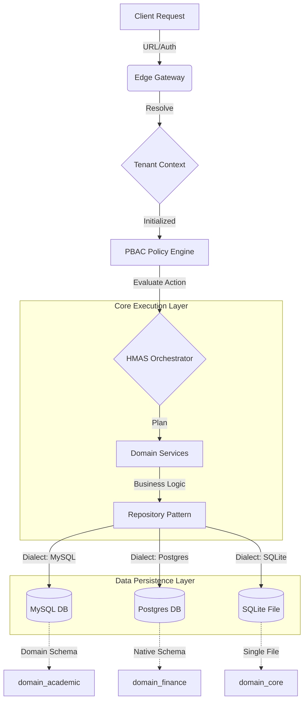

# EdApex: Planet-Scale Modern Architecture (Technical Specification)

EdApex is a next-generation, AI-native School Management Platform built for massive scale (100k+ schools) and deep AI autonomy. This document provides the **Low-Level Technical Specification**, consolidating all details from `v1` (Foundations), `v2` (HMAS), `v3` (Federation), and the `PBAC.md` security specs.

---

## 0. Architectural Flow (Visual)

### 0.1 High-Level Request Lifecycle (Mermaid)


### 0.2 System Hierarchy (ASCII)
```text
[ REQUEST ]
    |
    v
+---------------------------------------+
|        1. INFRASTRUCTURE LAYER        |
|  (Tenant Resolution, Auth, Context)   |
+---------------------------------------+
    |
    v
+---------------------------------------+
|          2. SECURITY (PBAC)           |
|  (Subject + Action + Resource + Env)  |
+---------------------------------------+
    |
    v
+---------------------------------------+
|       3. INTELLIGENCE (HMAS)          |
|  (Orchestrator -> Supervisor -> Agent)|
+---------------------------------------+
    |
    v
+---------------------------------------+
|         4. DOMAIN REPOSITORIES        |
|  (MySQL | PostgreSQL | SQLite/LibSQL) |
+---------------------------------------+
    |
    v
[ PERSISTENCE ]
```

---

## 1. Multi-Tenant Infrastructure Layer

### 1.1 Tenant Resolution
Every school/campus is a standalone **tenant**. Resolution happens at the Edge Gateway:
- **Subdomain**: `schoolname.edapex.ai`
- **Custom Domain**: `portal.schoolname.edu`
- **API Key/JWT**: Injected headers for mobile/external integrations.

### 1.2 Tenant Context Engine
The context is initialized for every request and persistent through the execution lifecycle:
```json
{
  "tenant_id": "8d3e2... (UUID)",
  "user_id": "u_942... (UUID)",
  "academic_year_id": "ay_2026",
  "timezone": "Africa/Lagos",
  "policy_overrides": []
}
```

### 1.3 Data Persistence & Multi-Database Support
To support diverse deployment environments (MySQL, PostgreSQL, SQLite, LibSQL), EdApex strictly employs the **Repository Pattern**:
- **Schema Separation**: Drizzle ORM definitions are siloed by dialect (e.g., `src/db/mysql/`, `src/db/sqlite/`). *For PostgreSQL, native Database Schemas (`CREATE SCHEMA domain_academic;`) are heavily utilized to strictly isolate domains from one another at the RDBMS level.*
- **Domain Interfaces**: Business logic depends strictly on `IRepository<T>` contracts (e.g., `ITenantRepository`).
- **Dependency Injection**: The server dynamically injects the `MysqlRepository` or `SqliteRepository` implementations based on the `DATABASE_DIALECT` environment variable, ensuring 0% business logic rewrite when switching databases.

### 1.4 Data Isolation
Strict logical isolation is enforced across the active database:
- **Schema**: Shared database with `tenant_id` partitioning.
- **Query Control**: All database queries MUST include a `WHERE tenant_id = ?` filter.
- **Indexing**: Composite indexes prioritize `(tenant_id, id)` and `(tenant_id, created_at)`.

---

## 2. Policy-Based Access Control (PBAC)

PBAC is the primary security mechanism, moving beyond static roles to dynamic attribute evaluation.

### 2.1 PBAC Components
- **Subjects**: `student`, `teacher`, `parent`, `accountant`, `admin`, `librarian`, `driver`, `warden`, and **AI Agents**.
- **Resources**: `student_record`, `exam`, `attendance`, `fees`, `library_book`, `inventory_item`, `payroll`.
- **Actions**: `create`, `read`, `update`, `delete`, `approve`, `grade`, `collect`, `assign`, `execute`.
- **Environment**: `tenant_id`, `time`, `location`, `ip_address`, `device_id`.

### 2.2 Evaluation Logic
Policies are evaluated by the **PBAC Policy Engine** before any agent or service execution:
```yaml
Policy: "Teacher Grading"
Effect: "Allow"
Condition: 
  Subject.Role == "teacher"
  AND Resource.Type == "ExamMark"
  AND Resource.SubjectID IN Subject.AssignedSubjects
  AND Environment.IsWithinAcademicYear == true
```

---

## 3. Hierarchical Multi-Agent System (HMAS)

HMAS organizes AI intelligence into four distinct functional layers to ensure stability and reasoning depth. All layers are implemented using the **Mastra AI SDK**.

### Level 1: Executive Orchestrator
- **Responsibility**: Interprets natural language intent, decomposes into multi-domain plans, and manages cross-domain context.
- **Coordination**: Uses state-machine logic to track the completion of sub-plans across Supervisors.

### Level 2: Domain Supervisors
- **Registry**: `academic_supervisor`, `finance_supervisor`, `hr_supervisor`, `attendance_supervisor`, etc.
- **Responsibility**: Manages domain-specific task agents. Ensures that a request like "Generate Report" correctly triggers the collection of attendance, grades, and behavioral data.

### Level 3: Task Agents
- **Atomic Operations**: Specialized agents like `student_registration_agent` or `payroll_generator_agent`.
- **Isolation**: These agents have access to specific domain knowledge but cannot "see" other domains without going back to the Supervisor.

### Level 4: Tool Execution Layer
- **Responsibility**: Validates the JSON schema of agent tool calls.
- **Gatekeeping**: Enforces the PBAC check *before* the domain service is called.

---

## 4. Federated Multi-School Intelligence (FMSIA)

FMSIA enables cross-tenant intelligence without compromising data privacy.

| Layer | Type | Data Scope | AI Output |
| :--- | :--- | :--- | :--- |
| **Layer 1** | Local | Deep Tenant Data | Personalized Student Alerts (e.g., "Sarah might fail Math") |
| **Layer 2** | Federated | Anonymized Gradients | Cross-School Pattern detection (e.g., "New syllabus is 20% harder") |
| **Layer 3** | Global | Synthetic/Aggregate | Planet-Scale Benchmarking & Curriculum Intelligence |

---

## 5. Domain Module Architecture (V2 Schema)

EdApex V2 decomposes the monolith into 14 distinct functional domains, each encapsulated in `src/db/domain-*.ts`. This modularity ensures that specialized AI agents can operate within bounded contexts while maintaining strict multi-tenant isolation.

### 5.1 Platform Foundations

| Domain | Key Entities | Core Modern Logic |
| :--- | :--- | :--- |
| **Core & Identity** | `tenants`, `accounts`, `auth_accounts`, `users`, `academic_years` | Better-Auth identity provider; decouples platform ID from school personas. |
| **PBAC & Security**| `policy_definitions`, `role_assignments` | Replaces static RBAC with dynamic, attribute-based policy evaluation. |
| **Settings** | `settings` | A polymorphic, ledger-based config system with hierarchical overrides. |
| **Documents** | `documents` | Unified polymorphic storage replacing 6+ fragmented legacy upload tables. |
| **Domain Events** | `domain_events` | An immutable audit log of all system state changes for event-driven reliability. |

### 5.2 Academic & Assessment

| Domain | Key Entities | Core Modern Logic |
| :--- | :--- | :--- |
| **Academic** | `classes`, `sections`, `subjects`, `routines`| Uses M:N junction mapping for classes/sections and time-slot normalization. |
| **Assessment** | `exams`, `exam_marks`, `computed_results` | Decouples exam definitions from mark setups; event-driven result engine. |
| **Attendance** | `attendances` | Unified student/staff/subject tracking with anomaly detection triggers. |
| **LMS (AI-First)** | `courses`, `lessons`, `progress`, `tutoring_sessions` | Built for RAG; dynamic learning paths based on analytics and AI feedback. |

### 5.3 Human Resources & Finance

| Domain | Key Entities | Core Modern Logic |
| :--- | :--- | :--- |
| **Finance** | `fees_masters`, `fee_assignments`, `ledger_entries` | Every transaction automatically generates a double-entry ledger record. |
| **HR & Payroll** | `hr_metadata`, `payroll_runs`, `leave_requests` | "User-Persona" model; automated payroll triggers based on attendance events. |

### 5.4 Logistics & Life

| Domain | Key Entities | Core Modern Logic |
| :--- | :--- | :--- |
| **Facilities** | `dormitories`, `rooms`, `routes`, `vehicles`, `allocations`, `inventory` | Physical assets with AI-driven route optimization and smart stocking. |
| **Library** | `books`, `book_categories`, `book_issues` | ISBN-first cataloging; event-driven library fines linked to student ledgers. |
| **Communication** | `communication_events`, `recipients` | Omni-channel dispatch (SMS, Push, Email) with toxicity moderation agents. |

---

## 6. Implementation Workflow

To maintain this spec, all domain modifications must follow the **Agent Orchestration** protocol:

1. **Review**: Agents analyze the legacy Laravel codebase in `/home/beznet/Workspace/schoolify`. This involves an **Exhaustive Search** of all code paths (Controllers, Models, Middleware, Helpers, and Event Listeners) to ensure 100% logic parity.
2. **Bridge**: Agents map `docs/infix_edu.sql` (V1) to `src/db/domain-*.ts` (V2).
3. **Justify**: Every proposed schema modification must include a **Low-Level Technical Justification**.
4. **Approval**: MODIFICATIONS ARE FORBIDDEN without explicit documentation review by the USER.

---

## 7. Event-Driven Reliability

The platform uses a distributed Event Bus to synchronize state across decoupled micro-agents:
- **Producers**: Domain Services emit events like `exam_submitted`.
- **Consumers**: Task Agents subscribe to events to trigger follow-up actions (e.g., `grading_agent` starts work when an exam is submitted).
- **Log**: Every event is stored in `edx_domain_events` for audit and replay.

---

## 8. AI Engine & Mastra SDK

The core of EdApex's intelligence is built on the **Mastra AI SDK**, providing a unified framework for agents, workflows, and persistence.

### 8.1 Agents & Orchestration
- **Mastra Agents**: Every HMAS agent is a `Mastra.Agent` instance with specialized tools and instructions.
- **Workflow State**: Complex multi-step processes (e.g., student onboarding) are managed via `Mastra.Workflow` to ensure state persistence and error recovery.

### 8.2 Memory & Continuity
Mastra's `Memory` system is used to handle cross-interaction coherence:
- **Thread Management**: Conversation threads are tracked per-user/per-tenant.
- **Semantic Recall**: Uses vector-based lookup to retrieve historical interactions relevant to the current task.
- **Working Memory**: Short-term state passed between agents in the HMAS hierarchy.

### 8.3 Storage Adapters
Mastra requires a `Storage` adapter to persist memory and logs. 
- **`[DB]Store` Adapter**: A custom or Drizzle-based `[DB]Store` (e.g., `MysqlStore`, `PostgresStore`) MUST be used to persist threads, messages, and workflow snapshots to the `edapex_v2` database based on the active environment dialect.
- **Schema Management**: Mastra's internal memory tables (e.g., `mastra_messages`, `mastra_threads`) are currently integrated into the V2 migration lifecycle.

### 8.4 TODO: Decoupled Persistence & Stateless Execution
*Note: This architecture is currently deferred for future implementation.*
To prevent **Vendor Lock-in** with Mastra's proprietary interfaces, the platform should eventually migrate to a **Stateless Agent Execution Model**:
- Treat `ai_chats` and `ai_messages` natively via Drizzle ORM repositories, wholly agnostic of the AI SDK.
- The `AiService` loads conversation history and invokes the Mastra agent statelessly:
  ```typescript
  // Load agnostic history -> Map to generic LLM array -> Invoke -> Save back natively
  const history = await repository.getChats(id);
  const response = await agent.generate(history.map(m => m.parts));
  ```
- This ensures that migrating to a different AI SDK in the future requires zero database schema restructuring.
