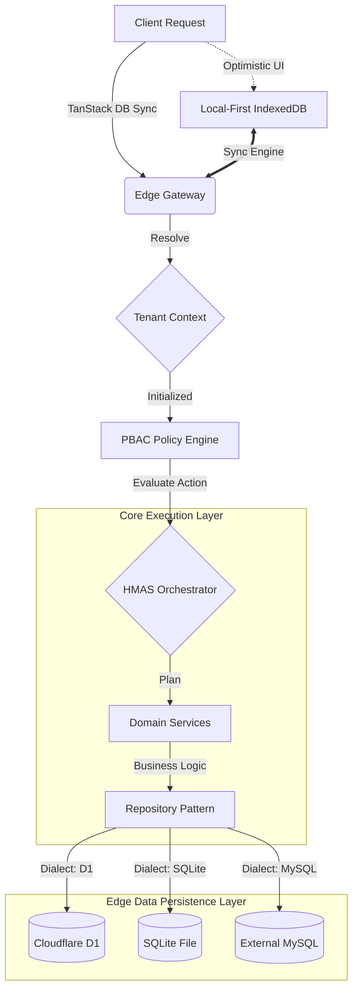

# EdApex: Planet-Scale Modern Architecture (Technical Specification)

EdApex is a next-generation, AI-native School Management Platform built for massive scale (100k+ schools) and deep AI autonomy. This document provides the **Low-Level Technical Specification**, consolidating all details from `v1` (Foundations), `v2` (HMAS), `v3` (Federation), and the `PBAC.md` security specs.

---

## 🧭 Project Navigation Map

| Document | Purpose |
| :--- | :--- |
| **[Business Model](docs/BUSINESS_MODEL.md)** | Strategic pillars (B2B Institutional vs B2C Retail). |
| **[Project Roadmap](docs/PROJECT_ROADMAP.md)** | Real-time tracking of development phases and layer status. |
| **[Domain Specs](docs/domains/)** | Comprehensive directory of per-module technical specifications. |
| **[Todo: Stateless AI](docs/TODO_STATELESS_AI.md)** | Research notes on decoupling from LLM-vendor lock-in. |

---

## 0. Architectural Flow (Visual)

### 0.1 High-Level Request Lifecycle (Mermaid)


### 0.2 System Hierarchy (ASCII)
```text
[ REQUEST ]
    |
    v
+---------------------------------------+
|        1. INFRASTRUCTURE LAYER        |
|  (Tenant Resolution, Auth, Context)   |
+---------------------------------------+
    |
    v
+---------------------------------------+
|          2. SECURITY (PBAC)           |
|  (Subject + Action + Resource + Env)  |
+---------------------------------------+
    |
    v
+---------------------------------------+
|       3. INTELLIGENCE (HMAS)          |
|  (Orchestrator -> Supervisor -> Agent)|
+---------------------------------------+
    |
    v
+---------------------------------------+
|         4. DOMAIN REPOSITORIES        |
|  (MySQL | PostgreSQL | SQLite/LibSQL) |
+---------------------------------------+
    |
    v
[ PERSISTENCE ]
```

---

## 1. Multi-Tenant Infrastructure Layer

### 1.1 Tenant Resolution
Every school/campus is a standalone **tenant**. Resolution happens at the Edge Gateway:
- **Subdomain**: `schoolname.edapex.ai`
- **Custom Domain**: `portal.schoolname.edu`
- **API Key/JWT**: Injected headers for mobile/external integrations.

### 1.2 Tenant Context Engine
The context is initialized for every request and persistent through the execution lifecycle:
```json
{
  "tenant_id": "8d3e2... (UUID)",
  "user_id": "u_942... (UUID)",
  "academic_year_id": "ay_2026",
  "timezone": "Africa/Lagos",
  "policy_overrides": []
}
```

### 1.3 Data Persistence & Multi-Database Support
To support diverse deployment environments (MySQL, PostgreSQL, SQLite, LibSQL), EdApex strictly employs the **Repository Pattern**:
- **Schema Separation**: Drizzle ORM definitions are siloed by dialect (e.g., `src/db/mysql/`, `src/db/sqlite/`). *For PostgreSQL, native Database Schemas (`CREATE SCHEMA domain_academic;`) are heavily utilized to strictly isolate domains from one another at the RDBMS level.*
- **Domain Interfaces**: Business logic depends strictly on `IRepository<T>` contracts (e.g., `ITenantRepository`).
- **Dependency Injection**: The server dynamically injects the `MysqlRepository` or `SqliteRepository` implementations based on the `DATABASE_DIALECT` environment variable, ensuring 0% business logic rewrite when switching databases.

### 1.4 Data Isolation
Strict logical isolation is enforced across the active database:
- **Schema**: Shared database with `tenant_id` partitioning.
- **Query Control**: All database queries MUST include a `WHERE tenant_id = ?` filter.
- **Indexing**: Composite indexes prioritize `(tenant_id, id)` and `(tenant_id, created_at)`.

---

## 2. Policy-Based Access Control (PBAC)

PBAC is the primary security mechanism, moving beyond static roles to dynamic attribute evaluation.

### 2.1 PBAC Components
- **Subjects**: `student`, `teacher`, `parent`, `accountant`, `admin`, `librarian`, `driver`, `warden`, and **AI Agents**.
- **Resources**: `student_record`, `exam`, `attendance`, `fees`, `library_book`, `inventory_item`, `payroll`, `classroom_session`.
- **Actions**: `create`, `read`, `update`, `delete`, `approve`, `grade`, `collect`, `assign`, `execute`, `stream`.
- **Environment**: `tenant_id`, `time`, `location`, `ip_address`, `device_id`.

### 2.2 Evaluation Logic
Policies are evaluated by the **PBAC Policy Engine** before any agent or service execution:
```yaml
Policy: "Teacher Grading"
Effect: "Allow"
Condition: 
  Subject.Role == "teacher"
  AND Resource.Type == "ExamMark"
  AND Resource.SubjectID IN Subject.AssignedSubjects
  AND Environment.IsWithinAcademicYear == true
```

---

## 3. Hierarchical Multi-Agent System (HMAS)

HMAS organizes AI intelligence into four distinct functional layers to ensure stability and reasoning depth. All layers are implemented using the **Mastra AI SDK**.

### Level 1: Executive Orchestrator
- **Responsibility**: Interprets natural language intent, decomposes into multi-domain plans, and manages cross-domain context.
- **Coordination**: Uses state-machine logic to track the completion of sub-plans across Supervisors.

### Level 2: Domain Supervisors
- **Registry**: `academic_supervisor`, `finance_supervisor`, `hr_supervisor`, `attendance_supervisor`, `classroom_supervisor`, etc.
- **Responsibility**: Manages domain-specific task agents. Ensures that a request like "Generate Report" correctly triggers the collection of attendance, grades, and behavioral data.

### Level 3: Task Agents
- **Atomic Operations**: Specialized agents like `student_registration_agent` or `payroll_generator_agent`.
- **Isolation**: These agents have access to specific domain knowledge but cannot "see" other domains without going back to the Supervisor.

### 3.4 Deployed Agent Skills (Hermes Standard)
Every agent in the HMAS hierarchy retrieves its operational knowledge from the **Skills System**:
- **Progressive Disclosure**: Token-efficient loading of `src/services/ai/skills/{domain}/SKILL.md`.
- **Procedural Memory**: Skills bundle verified `scripts/` (e.g., migration tools) and `templates/` (e.g., report formats).
- **Fallback Logic**: Skills can declare conditional activation for local-first recovery when edge latency is high.

### 3.5 The EdApex Stress Lab (Sidecar Isolation)
To maintain environment parity while ensuring production safety:
- **The Laboratory**: A self-contained, restricted mode of the EdApex V2 backend (`MODE=STRESS_LAB`).
- **Isolation**: Hardware-capped via Docker (`cpus`, `memory`) or physically isolated on a remote diagnostic VPS.
- **Data Airgap**: Operates on a **Disposable SQLite Instance**, cloning tenant schemas for destructive chaos tests and benchmarking Section 24 performance budgets.
- **Hybrid Bridge**: Edge Workers "snap" (delegate) high-risk tools into the Lab via a secure mTLS/SSH bridge.

### 3.6 Persistent Memory (HMAS Context)
To maintain long-term coherence across sessions and platforms:
- **Three-Tier Buffer**: Memory is partitioned into `EXECUTIVE` (Institution), `DOMAIN` (Supervisor), and `USER` (Individual) tiers.
- **Environment Agnostic**: Persistence is handled via **Drizzle ORM** (D1 for Edge, Postgres for VPS/Docker) with **TanStack DB** client-side synchronization.
- **Session Lineage**: [HIGH-FIDELITY] Every conversation turn implements `parent_session_id` chains to maintain a chronological narrative across multi-year academic cycles, even after history compression.
- **Frozen Snapshot**: At the start of an orchestration cycle, the pre-fetched memory buffer is injected into the system prompt as an immutable context block.
- **Boundary-Aware Compaction**: [HIGH-FIDELITY] The Auditor Agent executes async dual-stage history compaction (85% hygiene / 50% summarization). To prevent context breakage, it walk-back realigns boundaries to ensure `tool_call` and `tool_result` pairs are never split.
- **Provider Mirroring**: Supports external sync (e.g., Mem0, Honcho) via an async event-bus pattern.

### 3.7 Dynamic Educational Structures as AI Skills
To achieve massive global scale across varying educational models (e.g., Nigerian 6-3-3-4 vs. K-12 vs. IB vs. UK A-Levels), **School Structures are removed from the database level**. Instead, they are defined strictly as dynamic "AI Skills" injected directly into the HMAS orchestration layer.
- **Structural Loading**: When a campus is instantiated, the Executive Orchestrator pulls a localized structural skill (e.g., `structure-ube-nigeria.md`). This skill dictates local concepts like grading rubrics, "Terms", "Semesters", and critical boundary rules (e.g., UBE is free by federal law, whereas ECCDE Crèche bills tuition).
- **Schema Autonomy**: The `domain-academic` schema utilizes entirely agnostic primitives (`classes`, `enrollments`) combined with Zod-validated JSON `metadata`. The Orchestrator leverages the runtime Skill structure to map real-world meaning to these agnostic DB rows.

### 3.8 Context & Personality (Grounding Layer)
To maintain grounding and consistent identity:
- **SOUL.md (Identity)**: A global identity file defining the "Institutional Voice" of EdApex AI.
- **Hierarchical Context**: Automatic loading of `AGENTS.md` (Project) and `SKILL.md` (Domain) into the system prompt.
- **Context References (@)**: Inline parsing of `@file`, `@folder`, and `@url` for precision grounding, utilizing a 70/20 head-tail truncation strategy for edge safety.

### 3.9 AI Providers, Routing & Fallback (Resilience Layer)
To ensure cost-efficiency and 100% uptime:
- **Dynamic Provider Registry**: A configuration-driven system that maps models to providers (Workers AI, OpenAI, Anthropic, Ollama).
- **Smart Routing**: Automatic request sorting based on `price`, `latency`, or `throughput`.
- **Mid-Session Failover**: Automatic fallback to secondary providers (e.g., OpenAI -> Workers AI) if the primary model encounters rate limits or errors, retaining session context.
- **OpenAI-Compatible Gateway**: Exposing the HMAS Orchestrator as a standardized API (/v1/chat) for external interoperability.

### 3.10 Orchestration & Governance (Paperclip Standard)
To ensure industrial-grade reliability and institutional oversight:
- **Atomic Task Checkout**: [HIGH-FIDELITY] Mandates a single-trip SQL update pattern (via `checkoutTask`) to prevent task-claim collisions across distributed Edge nodes, ensuring that exactly one agent acquires a `PENDING` task.
- **Recursive Strategy Goals**: Implements a 4-level goal hierarchy (**Institution > Department > Agent > Task**) to align AI activities with academic terms and departmental budgets.
- **Governance Approval Gates**: High-risk actions (e.g., budget overrides, sensitive data access) trigger `ai_approvals` which halt the agent loop until a human administrator provides a signed decision via the Command Center.
- **Financial Cost Attribution**: Every task execution emits an `ai_cost_event`, attributing LLM expenditures to specific goals and departments for precise forensic accounting.
- **Forensic Audit Trace**: Level-8 forensic tracing logs every actor-entity interaction in `ai_activity_logs`, providing a complete reconstruction of agent reasoning and tool usage.

---

## 4. Federated Multi-School Intelligence (FMSIA)

FMSIA enables cross-tenant intelligence without compromising data privacy.

| Layer | Type | Data Scope | AI Output |
| :--- | :--- | :--- | :--- |
| **Layer 1** | Local | Deep Tenant Data | Personalized Student Alerts (e.g., "Sarah might fail Math") |
| **Layer 2** | Federated | Anonymized Gradients | Cross-School Pattern detection (e.g., "New syllabus is 20% harder") |
| **Layer 3** | Global | Synthetic/Aggregate | Planet-Scale Benchmarking & Curriculum Intelligence |

---

## 5. Domain Module Architecture (V2 Schema)

EdApex V2 decomposes the monolith into 18 distinct functional domains, each encapsulated in `src/db/domain-*.ts`. This modularity ensures that specialized AI agents can operate within bounded contexts while maintaining strict multi-tenant isolation.
> [!NOTE] 
> For detailed low-level documentation spanning entity mappings and PBAC rules per domain, see the **[Domain Specification Index](#56-domain-specification-index)** below.

### 5.1 Platform Foundations

| Domain | Key Entities | Core Modern Logic |
| :--- | :--- | :--- |
| **Core & Identity** | `tenants`, `accounts`, `auth_accounts`, `users`, `academic_years` | Better-Auth identity provider; decouples platform ID from school personas. |
| **PBAC & Security**| `policy_definitions`, `role_assignments` | Replaces static RBAC with dynamic, attribute-based policy evaluation. |
| **Settings** | `settings` | A polymorphic, ledger-based config system with hierarchical overrides. |
| **Documents** | `documents` | Unified polymorphic storage replacing 6+ fragmented legacy upload tables. |
| **Domain Events** | `domain_events` | An immutable audit log of all system state changes for event-driven reliability. |

### 5.2 Academic & Assessment

| Domain | Key Entities | Core Modern Logic |
| :--- | :--- | :--- |
| **Academic** | `classes`, `sections`, `subjects`, `routines`| Uses M:N junction mapping for classes/sections and time-slot normalization. |
| **Assessment** | `exams`, `exam_marks`, `computed_results` | Decouples exam definitions from mark setups; event-driven result engine. |
| **Attendance** | `attendances` | Unified student/staff/subject tracking with anomaly detection triggers. |
| **LMS (AI-First)** | `courses`, `lessons`, `progress`, `tutoring_sessions` | Built for RAG; dynamic learning paths based on analytics and AI feedback. |
| **Classroom (Agentic)** | `classroom_sessions`, `classroom_memory_ledger`, `classroom_participants`, `classroom_whiteboard_state` | OpenMAIC-powered live classroom with LangGraph state machine, SSE streaming, and dynamic engagement scoring. |

### 5.3 Human Resources & Finance

| Domain | Key Entities | Core Modern Logic |
| :--- | :--- | :--- |
| **Finance** | `fees_masters`, `fee_assignments`, `ledger_entries` | Every transaction automatically generates a double-entry ledger record. |
| **HR & Payroll** | `hr_metadata`, `payroll_runs`, `leave_requests` | "User-Persona" model; automated payroll triggers based on attendance events. |

### 5.4 Logistics & Life

| Domain | Key Entities | Core Modern Logic |
| :--- | :--- | :--- |
| **Facilities** | `dormitories`, `rooms`, `routes`, `vehicles`, `allocations`, `inventory` | Physical assets with AI-driven route optimization and smart stocking. |
| **Library** | `books`, `book_categories`, `book_issues` | ISBN-first cataloging; event-driven library fines linked to student ledgers. |
| **Communication** | `communication_events`, `recipients` | Omni-channel dispatch (SMS, Push, Email) with toxicity moderation agents. |

| **Homeschooling** | `homeschool_subscriptions`, `homeschool_portfolios`, `homeschool_schedules`, `revenue_shares`, `facilitators` | Wraps the LMS & Academic engines to provide personalized, TRCN-facilitator mentored homeschooling paths with Coding & Robotics focuses. |

### 5.6 Domain Specification Index

Every domain is governed by a dedicated specification file in `docs/domains/` that details the schema, repositories, and specific AI toolsets.

| Category | Specifications |
| :--- | :--- |
| **Foundations** | [Core & Identity](docs/domains/core.md) • [PBAC & Security](docs/domains/pbac.md) • [Settings](docs/domains/settings.md) • [Documents](docs/domains/documents.md) • [Events](docs/domains/events.md) |
| **Academic** | [Academic](docs/domains/academic.md) • [Assessment](docs/domains/assessment.md) • [Attendance](docs/domains/attendance.md) • [LMS](docs/domains/lms.md) • [Classroom](docs/domains/classroom.md) • [Homeschooling](docs/domains/homeschooling.md) |
| **Operations** | [Finance](docs/domains/finance.md) • [HR & Payroll](docs/domains/hr.md) • [Library](docs/domains/library.md) • [Facilities](docs/domains/facilities.md) |
| **Support** | [AI Engine](docs/domains/ai.md) • [Communication](docs/domains/communication.md) • [CMS](docs/domains/cms.md) |

---

## 6. Implementation Workflow

To maintain this spec, all domain modifications must follow the **Agent Orchestration** protocol:

1. **Review**: Agents analyze the legacy Laravel codebase in `/home/beznet/Workspace/schoolify`. This involves an **Exhaustive Search** of all code paths (Controllers, Models, Middleware, Helpers, and Event Listeners) to ensure 100% logic parity.
2. **Bridge**: Agents map `docs/infix_edu.sql` (V1) to `src/db/domain-*.ts` (V2).
3. **Justify**: Every proposed schema modification must include a **Low-Level Technical Justification**.
4. **Approval**: MODIFICATIONS ARE FORBIDDEN without explicit documentation review by the USER.

---

## 7. Event-Driven Reliability

The platform uses a distributed Event Bus to synchronize state across decoupled micro-agents:
- **Producers**: Domain Services emit events like `exam_submitted`, `ON_SESSION_START`, `CLASSROOM_TURN_COMPLETE`.
- **Consumers**: Task Agents subscribe to events to trigger follow-up actions (e.g., `grading_agent` starts work when an exam is submitted; `evaluator_agent` compresses memory on `CLASSROOM_TURN_COMPLETE`).
- **Log**: Every event is stored in `edx_domain_events` for audit and replay.

---

## 8. AI Engine & Mastra SDK

The core of EdApex's intelligence is built on the **Mastra AI SDK**, providing a unified framework for agents, workflows, and persistence.

### 8.1 Agents & Orchestration
- **Mastra Agents**: Every HMAS agent is a `Mastra.Agent` instance with specialized tools and instructions.
- **Workflow State**: Complex multi-step processes (e.g., student onboarding) are managed via `Mastra.Workflow` to ensure state persistence and error recovery.

### 8.2 Memory & Continuity
Mastra's `Memory` system is used to handle cross-interaction coherence:
- **Thread Management**: Conversation threads are tracked per-user/per-tenant.
- **Semantic Recall**: Uses vector-based lookup to retrieve historical interactions relevant to the current task.
- **Working Memory**: Short-term state passed between agents in the HMAS hierarchy.

### 8.3 Storage Adapters
Mastra requires a `Storage` adapter to persist memory and logs. 
- **`[DB]Store` Adapter**: A custom or Drizzle-based `[DB]Store` (e.g., `MysqlStore`, `PostgresStore`) MUST be used to persist threads, messages, and workflow snapshots to the `edapex_v2` database based on the active environment dialect.
- **Schema Management**: EdApex evolves the basic Mastra schema into a **High-Fidelity AI Persistence Layer**:
    - **`ai_sessions`**: Dialect-agnostic UUID mapping with `parent_session_id` and `token_stats`.
    - **`ai_messages`**: Rich trace metadata including `cache_breakpoint` (Boolean) and `tool_call_id`.
    - **`ai_tasks`**: Atomic orchestration units with status-lifecycle tracking.
    - **`ai_goals`**: Recursive strategy nodes for institutional alignment.
    - **`ai_approvals`**: Governance gates for human-in-the-loop oversight.

### 8.4 Stateless AI Execution Model
To meet the **Cloudflare 10ms CPU limit** and ensure **Edge-Native performance**, EdApex uses a **Stateless Agent Execution Model**:
- Treat `ai_sessions` and `ai_messages` natively via Drizzle ORM repositories, wholly agnostic of the AI SDK.
- The `AiService` loads conversation history and invokes the Mastra agent statelessly.
- This ensures minimal cold start overhead and zero vendor lock-in.

### 8.5 Agentic Classroom: OpenMAIC LangGraph Integration
The **Agentic Classroom** extends stateless execution via an OpenMAIC-powered **LangGraph `StateGraph`** (`director-graph.ts`):
- **Director Node**: Analyzes `FatContext` (session state + memory ledger) and routes to the appropriate agent via an LLM decision pass.
- **Agent Node (Teacher/Evaluator)**: Yields streaming **interleaved structured outputs** (`[{"type":"action", ...}, {"type":"text", ...}]`) over Hono SSE.
- **Stateless Resolution**: After each graph node execution, streamed `StatelessEvent` arrays are dehydrated to `classroomMemoryLedger` before yielding the edge CPU slice.
- **Escalation Edge**: Human instructors can inject an `escalation` event into the memory ledger to halt the autonomous loop and assume direct control.
- **Spec Reference**: [AGENTIC_SCHOOL_V2_PLAN.md](AGENTIC_SCHOOL_V2_PLAN.md) for full detail.

---

## 9. Canonical Directory Structure

To ensure 100% logic parity and strict adherence to the **Backend Feasibility & Risk Index (BFRI)**, EdApex V2 employs a standardized layered architecture.

### 9.1 Directory Hierarchy
```bash
src/
├── config/              # Centralized environment & unifiedConfig
├── controllers/         # Hono route handlers (req/res) via BaseController
├── services/            # Framework-agnostic business logic
│   └── ai/              # HMAS Intelligence & Orchestration
│       ├── strategy/    # [NEW] Orchestration logic & Agent Registry
│       ├── skills/      # [NEW] Deployed procedural memory (Hermes Standard)
│       └── agents/      # Mastra Agent & Workflow definitions
├── domain/              # Anti-Corruption Layer (Interfaces & Repositories)
│   ├── interfaces/      # e.g., core.interface.ts, ai.interface.ts
│   └── repositories/    # Drizzle ORM concrete implementations (mysql, postgres, sqlite)
├── db/                  # Drizzle schemas, relations, and migrations
├── routes/              # Hono route definitions
├── middleware/          # Auth, PBAC, Sentry, Rate Limiting
├── validators/          # Zod schemas for input validation
├── events/              # Event Bus & EDA definitions
├── types/               # Shared TypeScript types & Enums
├── utils/               # Helpers, loggers, formatting
├── tests/               # Unit, Integration, and E2E specs
├── instrument.ts        # Observability & Tracing setup
├── app.ts               # Hono App instance configuration
└── server.ts            # Bootstrapper & Dependency Injection
```

### 9.2 Layer Responsibilities

| Layer | Primary Responsibility | Guideline Alignment |
| :--- | :--- | :--- |
| **db/** | Drizzle ORM schema definitions and migrations. | `@database-architect` |
| **config/** | Unified configuration management; no raw `process.env` calls. | `@backend-dev-guidelines` |
| **controllers/** | Request orchestration & standardized API error envelopes. | `@api-design-principles` |
| **services/** | Domain complexity, HMAS orchestration, and business rules. | `@backend-architect` |
| **domain/** | Masks the database from the service layer via interfaces. | `@database-architect` |
| **middleware/** | Secure entry points (Auth/PBAC/Rate Limiting). | `@backend-security-coder` |
| **validators/** | Structural guarantee for all external payloads via Zod. | `@backend-security-coder` |
| **events/** | Event Bus definitions and domain-specific event handlers. | `@backend-architect` |

---

## 10. Edge-Native Optimization (Cloudflare Free Tier)

EdApex is optimized for the constraints of Cloudflare's edge network:

### 10.1 Constraint-First Design
- **3MB Bundle Size**: Aggressive code splitting via `wrangler` and dynamic imports for heavy AI providers.
- **10ms CPU Time**: Stateless execution, offloading heavy processing to the client or background tasks.
- **System + 3 Caching**: [HIGH-FIDELITY] To survive Edge budget constraints, prompt assembly utilizes Anthropic-style cache breakpoints: Section 1-46 as Immutable Breakpoint 1, with a rolling 3-turn window for Breakpoints 2-4.
- **10k AI Neurons/Day**: Runtime model tiering (Small/Medium/Large) and token usage tracking.

### 10.2 Local-First Synchronization
- **TanStack DB**: Acts as the primary state manager on the client (IndexedDB).
- **Background Sync**: Uses a conflict-resolution engine to synchronize local state with Cloudflare D1.

### 10.3 SSE Streaming Architecture
Real-time unidirectional streaming powers both the HMAS Pulse telemetry and the Agentic Classroom:
- **Hono SSE Pipe**: Streams `StatelessEvent` chunks from LangGraph graph node yields to the browser.
- **Partial-JSON Parsing**: Edge-compatible incremental parser buffers incomplete JSON `[` arrays and yields deltas as they stabilize.
- **Stream-Time PBAC**: A regex-match interceptor validates each `action` element against the PBAC policy engine *within* the SSE stream, emitting inline `403` signals without terminating the connection.
- **Inertial Conflict Resolution**: In multi-observer scenarios, TanStack DB caches local inputs until SSE confirms state alignment with D1/SQLite.

### 10.4 AI Orchestration (Provider-Agnostic)
- **Mastra Core**: Lightweight orchestration without heavy stateful storage adapters.
- **Runtime Provider Selection**: Agents are defined by capability and use the cheapest/fastest available provider at runtime.


