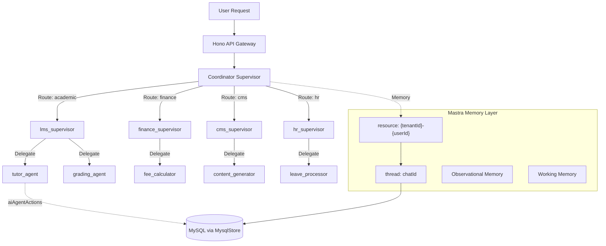

# AI Domain Architecture: Orchestration & Agent Infrastructure

## 1. Domain Overview

The AI domain is the **orchestration backbone** of the EdApex HMAS (Hierarchical Multi-Agent System). Unlike other domains that migrate legacy code, this module is **entirely new** — designed from scratch to power AI-native education through the **Mastra SDK**.

It comprises two sub-systems:

| Sub-system | Purpose | Tables |
|:---|:---|:---|
| **Chat Infrastructure** | User-facing conversational AI interface | `ai_chats`, `ai_messages`, `ai_votes`, `ai_documents`, `ai_suggestions` |
| **Agentic Infrastructure** | HMAS supervisor/task agent execution engine | `ai_agents`, `ai_agent_actions`, `ai_tool_invocations` |

### Key Design Principles
- **Mastra-Native**: All agent execution flows through `Mastra.Agent`, `Mastra.Workflow`, and `Mastra.Memory`
- **Tenant-Isolated**: Every chat thread and agent action is scoped by `tenant_id`
- **Observability-First**: Every agent invocation, tool call, and token usage is logged for auditing
- **Idempotent Execution**: `idempotency_key` on `ai_agent_actions` prevents duplicate work on retries

---

## 2. Schema Analysis

### Chat Infrastructure

#### [aiChats](file:///home/beznet/Workspace/edapex/src/db/domain-ai.ts#L50)
Maps to **Mastra Thread**. Each chat is a conversation thread owned by a user within a tenant. Table: `ai_chats`.
- `id` (varchar) → Mastra `threadId`
- `userId` → Mastra `resourceId` (combined as `{tenantId}-{userId}`)
- `metadata` → Stores `ChatMetadata` (summary, tags, lastMessagePreview)

#### [aiMessages](file:///home/beznet/Workspace/edapex/src/db/domain-ai.ts#L62)
Maps to **Mastra Messages**. Stores the conversation history within a thread. Table: `ai_messages`.
- `chatId` → FK to thread
- `role` → `user | assistant | system | tool`
- `parts` → JSON array of message parts (text, tool calls, tool results)

#### [aiVotes](file:///home/beznet/Workspace/edapex/src/db/domain-ai.ts#L72)
User feedback on assistant responses. Feeds into RLHF quality loops. Table: `ai_votes`.

#### [aiDocuments](file:///home/beznet/Workspace/edapex/src/db/domain-ai.ts#L82) / [aiSuggestions](file:///home/beznet/Workspace/edapex/src/db/domain-ai.ts#L91)
EdApex-specific: collaborative AI-generated documents with inline suggestions.

### Agentic Infrastructure

#### [aiAgents](file:///home/beznet/Workspace/edapex/src/db/domain-ai.ts#L102)
Registry of all HMAS agents — both Supervisors and Task Agents.
- `agentType` → Discriminator (e.g., `supervisor`, `task`, `background`)
- `capabilities` → JSON array of tool names this agent can invoke
- `config` → Agent-specific configuration (model, temperature, max tokens)

#### [aiAgentActions](file:///home/beznet/Workspace/edapex/src/db/domain-ai.ts#L116)
Execution log for agent invocations — the core audit trail.
- `idempotencyKey` → Prevents duplicate execution on retries
- `status` → Lifecycle: `pending → running → completed | failed`
- `input/output` → Full request/response payload for debugging

#### [aiToolInvocations](file:///home/beznet/Workspace/edapex/src/db/domain-ai.ts#L135)
Sub-step logs: each tool call within an agent action.

---

## 3. Mastra SDK Integration

### Memory Model Alignment

> [!IMPORTANT]
> Mastra has its own Memory model with native storage. The AI domain schema must align with Mastra's `resource` + `thread` scoping.

#### Mastra Memory Types → EdApex Mapping

| Mastra Memory Type | Purpose | EdApex Storage |
|:---|:---|:---|
| **Message History** | Raw conversation messages | `chats` + `messages` tables |
| **Observational Memory** | Background agents compress old messages into dense observations | Auto-managed by `@mastra/memory` |
| **Working Memory** | Persistent structured user data (names, preferences, goals) | `chats.metadata` or thread-scoped storage |
| **Semantic Recall** | Embedding-based retrieval of past messages | Requires vector store (separate from MySQL) |

#### Resource & Thread Scoping

```typescript
// EdApex → Mastra memory mapping
const response = await agent.generate(userMessage, {
  memory: {
    resource: `${tenantId}-${userId}`,  // Stable user identifier
    thread: chatId,                      // Maps to chats.id
  },
});
```

#### HMAS Memory Isolation
When a supervisor delegates to a subagent, Mastra auto-scopes memory:
- **Thread ID**: Fresh per delegation (subagent starts clean)
- **Resource ID**: `{parentResourceId}-{agentName}` (stable across delegations)
- **Memory Instance**: Subagent inherits supervisor's `Memory` if no own config

### Agent Configuration

```typescript
import { Agent } from '@mastra/core/agent';
import { Memory } from '@mastra/memory';

// Example: LMS Supervisor Agent
export const lmsSupervisor = new Agent({
  id: 'lms-supervisor',
  name: 'LMS Supervisor',
  instructions: `You are the LMS domain supervisor for EdApex...`,
  model: openai('gpt-4o'),
  tools: [enrollStudentTool, publishCourseTool, evaluateSubmissionTool],
  memory: new Memory({
    options: {
      lastMessages: 20,
      observationalMemory: true,  // Compress old messages
    },
  }),
});
```

### MySQL Storage Adapter

> [!CAUTION]
> **Mastra has no MySQL storage adapter.** EdApex requires a custom `MysqlStore` implementation.

Mastra supports: libSQL, PostgreSQL, MongoDB, Upstash, D1, DynamoDB, MSSQL — but **not MySQL**.

**Recommendation**: Build a custom `MysqlStore` implementing the `MastraStorage` interface:

```typescript
import { MastraStorage } from '@mastra/core';
import { drizzle } from 'drizzle-orm/mysql2';

export class MysqlStore extends MastraStorage {
  constructor(private db: ReturnType<typeof drizzle>) {
    super({ id: 'edapex-mysql-store' });
  }
  // Implement: saveThread, getThread, saveMessages, getMessages, etc.
}
```

### Workflow Integration

Agent actions map to Mastra Workflows for multi-step operations:

```typescript
import { Workflow } from '@mastra/core/workflow';

const gradingWorkflow = new Workflow({ name: 'grade-submission' })
  .step('fetch-submission', fetchSubmissionStep)
  .step('fetch-rubric', fetchRubricStep)
  .step('evaluate', evaluateStep)
  .step('store-result', storeResultStep);
```

---

## 4. HMAS Architecture

### Agent Hierarchy



### Agent Registry (aiAgents)

| Agent | Type | Domain | Capabilities |
|:---|:---|:---|:---|
| `coordinator` | `supervisor` | Global | Route requests to domain supervisors |
| `lms_supervisor` | `supervisor` | LMS | Enrollment, course management, pathing |
| `finance_supervisor` | `supervisor` | Finance | Fee management, ledger operations |
| `cms_supervisor` | `supervisor` | CMS | Content generation, moderation |
| `hr_supervisor` | `supervisor` | HR | Leave, payroll, evaluations |
| `tutor_agent` | `task` | LMS | 1-on-1 student tutoring via RAG |
| `grading_agent` | `task` | LMS | AI-powered submission evaluation |
| `content_generator` | `task` | CMS | AI article/event creation |
| `content_moderator` | `task` | CMS | Content safety scanning |
| `fee_calculator` | `task` | Finance | Fee computation and installments |

### Handoff Protocol

1. Supervisor receives user request
2. Supervisor determines domain + task via structured reasoning
3. Supervisor creates `aiAgentActions` record (`status: pending`)
4. Supervisor delegates to Task Agent with context
5. Task Agent executes, logging `aiToolInvocations`
6. Task Agent returns result, `aiAgentActions.status → completed`
7. Supervisor synthesizes response to user

---

## 5. PBAC & Security

### Policy Rules

| Rule | Effect | Conditions |
|:---|:---|:---|
| Tenant Chat Isolation | `allow` | `request.tenantId == chat.tenantId` |
| User Chat Ownership | `allow` | `request.userId == chat.userId` |
| Admin Chat Visibility | `allow` | `chat.visibility == public OR request.role == admin` |
| Agent Invocation Auth | `allow` | `request.role ∈ [admin, teacher] OR agent.allowedRoles.includes(request.role)` |
| Token Budget | `deny` | `user.tokenUsage >= tenant.tokenBudget` |
| Rate Limiting | `deny` | `user.requestCount > tenant.rateLimit` within time window |

### Security Measures
- **Token Budget Enforcement**: Track `promptTokens + completionTokens` in `MessageMetadata.usage`
- **Audit Trail**: Every agent action logged with full input/output in `aiAgentActions`
- **Idempotency**: `idempotency_key` prevents repeated charges on retries
- **Data Privacy**: Student data in agent context must be anonymized for external LLM calls

---

## 6. Recommendations & Justifications

### A. Build Custom `MysqlStore` (CRITICAL)
**Proposal**: Implement `MastraStorage` interface for MySQL using Drizzle ORM.
- **Justification**: No MySQL adapter exists in Mastra. Without it, EdApex cannot persist Mastra memory, threads, or agent state to its primary database.

### B. Add `tenantId` to `aiDocuments`
**Proposal**: Add `tenantId: int("tenant_id").references(() => tenants.id)` to `aiDocuments`.
- **Justification**: Currently missing tenant isolation — a critical security gap.

### C. Align Schema with Mastra Storage Interface
**Proposal**: Ensure `chats` and `messages` tables match Mastra's expected column structure.
- **Justification**: Avoids dual storage (Mastra-managed tables + custom EdApex tables). A single source of truth reduces complexity.

### D. Vector Store for Semantic Recall
**Proposal**: Integrate a vector database (e.g., pgvector, Qdrant, or Pinecone) for semantic recall.
- **Justification**: Required by `@mastra/memory` for embedding-based retrieval. Without it, agents can only recall via exact message history, limiting tutoring and long-term learning effectiveness.

### E. Hono API Routes

```
Routes → AiController → AiService → AiRepository → chats/messages/aiAgents
```

| Method | Route | Description |
|:---|:---|:---|
| `POST` | `/api/v1/ai/chat` | Create new chat thread |
| `GET` | `/api/v1/ai/chats` | List user's active threads |
| `GET` | `/api/v1/ai/chats/:id` | Get chat with messages |
| `POST` | `/api/v1/ai/chats/:id/messages` | Send message (streams response) |
| `POST` | `/api/v1/ai/chats/:id/vote` | Submit feedback on message |
| `POST` | `/api/v1/ai/agents/:id/invoke` | Invoke agent action |
| `GET` | `/api/v1/ai/agents/:id/actions` | List agent action history |
| `GET` | `/api/v1/ai/agents` | List registered agents for tenant |

### F. Domain Events

| Event | Payload | Consumers |
|:---|:---|:---|
| `ai.agent_invoked` | `{ agentId, actionId, tenantId, actionType }` | Events (audit), Settings (rate limit check) |
| `ai.action_completed` | `{ actionId, durationMs, tokenUsage }` | Finance (token billing), Events (audit) |
| `ai.action_failed` | `{ actionId, errorMessage }` | Events (alert), Communication (notify admin) |
| `ai.memory_compressed` | `{ threadId, observationCount }` | Events (audit) |
