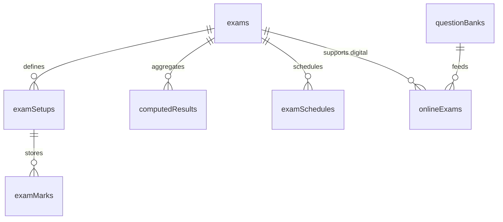

# Assessment Domain Architecture

## 🎯 Overview
The Assessment domain in EdApex V2 unifies physical exam tabulation, continuous assessment, and digital online examinations into a single, strictly-typed relational structure. It replaces the legacy system's reliance on flat mark stores and complex JSON-like parsing with a normalized architecture designed for high-fidelity reporting and AI-driven result computation.

## 📂 Legacy System Analysis

### Core Controllers
- `SmExamController`: Manages exam definitions and schedules.
- `SmExamMarkRegisterController`: Handles the entry of marks and the immediate aggregation into results.
- `SmMarksGradeController`: Manages GPAs and grading scales.

### Legacy Data Structure
| Legacy Table | Description | V2 Equivalent |
| :--- | :--- | :--- |
| `sm_exams` | Overall exam definition per subject/class. | `exams` |
| `sm_exam_types` | Term names (e.g., "First Term"). | `examType` (Enum) |
| `sm_exam_setups` | Breakdown of marks (MTA, CA, Exam). | `examSetups` |
| `sm_mark_stores` | Raw marks for each setup part. | `examMarks` |
| `sm_result_stores` | Aggregated totals, GPA, and Grades. | `computedResults` |
| `sm_exam_schedules` | Date/Time/Room for exams. | `examSchedules` |

### Critical Observations
- **Flat Storage**: Legacy uses `sm_mark_stores` which forces application logic to reconstruct the "Total" mark from multiple rows. V2 handles this via related `examMarks` and a refined `computedResults` table.
- **Immediate Aggregation**: Legacy calculates results synchronously during mark entry. V2 shifts this to an event-driven "Result Engine" to handle bulk updates and complex cross-subject GPA logic.
- **University Logic**: Legacy contains embedded "University" module checks. V2 isolates these into tenant-level features or separate domain extensions.

## 🏗️ V2 Architectural Design

### Entity Relationship Diagram


### Key Components

#### 1. Exam Configuration (`exams` & `examSetups`)
- **Normalized Breakdown**: `examSetups` allows per-tenant and per-subject mark distribution (e.g., Primary School might have 40/60 split, while Senior Secondary has 30/70).
- **Strict Typing**: Marks are stored as `decimal(8,2)` to ensure precision, replacing loose integer or string handling.

#### 2. Mark Capture (`examMarks`)
- **Is Absent**: A dedicated `is_absent` flag replaces the legacy "-1" or "absent" string hacks.
- **Auditability**: Tracks `graded_by` (Staff Persona) for every mark entry.

#### 3. Result Computation (`computedResults`)
- **High-Fidelity Metadata**: The `metadata` JSON column stores the `marksBreakdown`. This allows report cards to be generated directly from the result record without expensive joins back to raw marks.
- **Consolidation**: `teacherRemarks` are integrated directly into the result record, eliminating the need for a separate join table.

## 🤖 AI Task Agents & Automation

### Result Engine Agent
- **Trigger**: Fired when `examMarks` are updated, when an exam term is marked "Completed", or when an Agentic Classroom (Domain 18) `EvaluatorAgent` yields a graded turn transcript.
- **Function**: Performs bulk calculation of GPAs, Grades, and subject-wise positions. Aggregates micro-evaluations from immersive live sessions into long-term `computedResults`.
- **Verification**: Cross-references computed totals against `examSetups.exam_mark` constraints.

### Assessment Coordinator
- **Function**: Automatically generates `examSetups` based on historical patterns or school policy.
- **Validation**: Flags entries where total marks exceed the defined maximums (Logic parity with `CheckPoint 3` learnings).

## 🔒 Security & Multi-tenancy
- **Tenant Isolation**: All assessment data is scoped via `tenantId`.
- **PBAC**: Grading is restricted to assigned subject teachers or HODs via specific permission checks.
- **Academic Year Scoping**: Data is strictly partitioned by `academicId` to prevent historical data leakage into current terms.

---

## Hono API Routes

```
Routes → AssessmentController → AssessmentService → AssessmentRepository
```

| Method | Route | Description | Auth |
|:---|:---|:---|:---|
| `GET` | `/api/v1/exams` | List exams for academic year | Authenticated |
| `POST` | `/api/v1/exams` | Create exam definition | `TenantAdmin` |
| `GET` | `/api/v1/exam-setups` | List exam setups for class/subject | Teacher+ |
| `POST` | `/api/v1/exam-marks` | Submit marks for exam setup | Teacher |
| `GET` | `/api/v1/results` | Get computed results | Authenticated |
| `POST` | `/api/v1/results/compute` | Trigger result computation | `TenantAdmin` |
| `GET` | `/api/v1/question-banks` | List question bank | Teacher+ |
| `POST` | `/api/v1/online-exams` | Create online exam | Teacher+ |

---

## HMAS Agent Registry

| Agent | Type | Capabilities |
|:---|:---|:---|
| `result_engine` | Task | Bulk GPA/grade computation, ranking |
| `assessment_coordinator` | Task | Auto-generate exam setups from policy |
| `grading_agent` | Task | AI-powered submission evaluation |

---

## Domain Events

| Event | Payload | Consumers |
|:---|:---|:---|
| `assessment.marks_uploaded` | `{ examSetupId, classId, tenantId }` | AI (result_engine trigger) |
| `assessment.result_calculated` | `{ examId, classId, studentCount }` | Communication (report cards), Events (audit) |
| `assessment.online_exam_submitted` | `{ attemptId, userId, onlineExamId }` | AI (auto-grading) |
