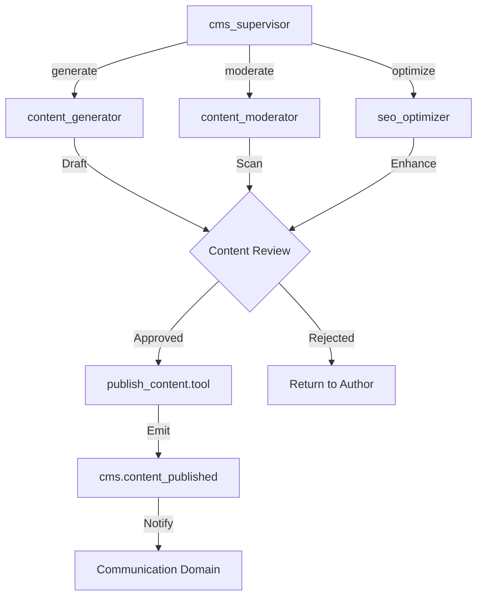

# CMS Domain Architecture: Content Management System

## 1. Domain Overview

The CMS domain manages the **public-facing content layer** of each EdApex tenant. It consolidates 10+ fragmented legacy tables into a single polymorphic `content_nodes` model, enabling each school to maintain its own branded website with news, events, pages, galleries, testimonials, and slider banners — all within strict multi-tenant isolation.

### Key Business Logic
- **Polymorphic Content Engine**: A single `content_nodes` table with a `content_type` discriminator replaces 10 legacy tables. Type-specific fields live in a strongly-typed `metadata` JSON column.
- **Tenant Branding**: Each school operates an independent public facade. Content is strictly scoped by `tenant_id`.
- **Menu Hierarchy**: `parent_id` self-reference enables nested navigation menus without a separate menu table.
- **SEO-Ready**: Built-in `slug` column with a `(tenant_id, slug)` composite index for fast, unique URL resolution.
- **AI-Augmented**: Content generation and moderation are first-class concerns, powered by HMAS task agents.

---

## 2. Entity Mapping (V1 → V2)

### Schema Consolidation

| Legacy Table (`schoolify`) | V2 Content Type | Key V1 Fields | V2 Mapping |
|:---|:---|:---|:---|
| `sm_pages` | `page` | `title`, `slug`, `details`, `header_image` | `title`, `slug`, `body`, `image` |
| `sm_about_pages` | `page` | `title`, `description`, `image` | Merged into `page` type |
| `sm_contact_pages` | `page` | `address`, `phone`, contact fields | `page` + `metadata.seoDescription` |
| `sm_course_pages` | `page` | `title`, `description`, `image` | Merged into `page` type |
| `sm_news` | `news` | `news_title`, `news_body`, `category_id`, `view_count` | `title`, `body`, `metadata` |
| `sm_news_categories` | — | `category_name`, `type` | Moved to `enumerations` domain |
| `sm_news_comments` | — | `message`, `news_id`, `user_id`, `parent_id` | **Recommendation**: New `content_comments` table |
| `sm_news_pages` | `page` | `title`, `description`, `main_image` | Merged into `page` type |
| `sm_events` | `event` | `event_title`, `event_location`, `from_date`, `to_date` | `title`, `metadata.eventDate/eventLocation` |
| `home_sliders` | `slider` | `image`, `link` | `image`, `metadata.linkUrl/linkLabel/sortOrder` |

### Structural Improvements
- **10 → 1 table**: Eliminates schema fragmentation and cross-table queries
- **Strict typing**: `content_type` enum prevents invalid content categories
- **JSON metadata**: Type-specific fields (event dates, slider links, SEO keywords) stored in `ContentNodeMetadata`
- **Author tracking**: `author_id` FK to `users` (Staff persona) replaces loose `created_by` integers

---

## 3. AI Agent & Tool Integration

### HMAS Agent Architecture

| Agent | Type | Responsibility |
|:---|:---|:---|
| `cms_supervisor` | Domain Supervisor | Routes content tasks, manages publish workflows, enforces tenant branding policies |
| `content_generator` | Task Agent | AI-powered article/event creation from prompts using school context |
| `content_moderator` | Task Agent | Scans content for inappropriate material, compliance violations |
| `seo_optimizer` | Task Agent | Enhances content with SEO metadata, keyword optimization |

### Mastra Tools

| Tool | Input Schema | Output | Description |
|:---|:---|:---|:---|
| `create_content.tool` | `{ tenantId, contentType, title, body?, metadata? }` | `ContentNode` | Creates draft content node |
| `publish_content.tool` | `{ contentNodeId }` | `ContentNode` | Validates and publishes content |
| `moderate_content.tool` | `{ contentNodeId }` | `{ approved: boolean, flags: string[] }` | AI content moderation |
| `generate_article.tool` | `{ tenantId, topic, contentType, tone? }` | `ContentNode` (draft) | Generates article/event from prompt |
| `optimize_seo.tool` | `{ contentNodeId }` | `{ seoDescription, seoFocusKeyword }` | SEO enhancement |
| `schedule_content.tool` | `{ contentNodeId, publishAt }` | `ContentNode` | Schedules future publication |

### Content Pipeline Workflow



---

## 4. PBAC & Security

### Policy Rules

| Rule | Effect | Conditions |
|:---|:---|:---|
| Tenant Isolation | `allow` | `request.tenantId == content.tenantId` |
| Author Write | `allow` | `action ∈ [update, delete] AND request.userId == content.authorId` |
| Admin Publish | `allow` | `action == publish AND request.role ∈ [admin, school_admin]` |
| Public Read | `allow` | `action == read AND content.publishedStatus == 1` |
| Draft Read | `allow` | `action == read AND content.publishedStatus == 0 AND (request.userId == content.authorId OR request.role == admin)` |
| AI Moderation Bypass | `deny` | `content.moderationStatus == flagged AND action == publish` |

### Security Measures
- **Tenant Isolation**: Every query MUST include `WHERE tenant_id = :tenantId`
- **XSS Prevention**: `body` field must be sanitized via DOMPurify before storage
- **Rate Limiting**: Content creation endpoints capped per tenant to prevent spam

---

## 5. Recommendations & Justifications

### Schema Enhancements

#### A. Add `publishedAt` Timestamp
**Proposal**: Add `publishedAt: timestamp("published_at")` to `content_nodes`.
- **Justification**: Currently `publishedStatus` is a boolean. A timestamp enables "scheduled publishing" — drafts auto-publish at a future date. The `cms_supervisor` can poll for `publishedAt <= NOW() AND publishedStatus = 0` to trigger auto-publish.

#### B. Add `categoryId` Foreign Key
**Proposal**: Add `categoryId: int("category_id").references(() => enumerations.id)` to `content_nodes`.
- **Justification**: The legacy `sm_news` had `category_id → sm_news_categories`. V2 should use the `enumerations` domain (`domain = 'content_category'`) for reusable taxonomy. This enables AI agents to auto-categorize generated content.

#### C. Add `expiresAt` for Events
**Proposal**: Add `expiresAt: timestamp("expires_at")` to `content_nodes`.
- **Justification**: Events have a natural end date. Auto-archival of expired events keeps public facades clean. The `cms_supervisor` can expire events via `expiresAt <= NOW()`.

#### D. New `content_comments` Table
**Proposal**: Create a separate `content_comments` table for threaded comments.
- **Justification**: Legacy `sm_news_comments` supported threaded comments (`parent_id`). This functionality should not be lost in the V2 consolidation. A dedicated table with `contentNodeId`, `userId`, `body`, `parentId`, `status` enables moderated comment threads.

### Hono API Routes

```
Routes → CmsController → CmsService → CmsRepository → contentNodes
```

| Method | Route | Description |
|:---|:---|:---|
| `GET` | `/api/v1/cms/content` | List content (filterable by `contentType`, paginated) |
| `GET` | `/api/v1/cms/content/:slug` | Get single content node by slug |
| `POST` | `/api/v1/cms/content` | Create content node (requires `admin` role) |
| `PATCH` | `/api/v1/cms/content/:id` | Update content node |
| `DELETE` | `/api/v1/cms/content/:id` | Soft-delete content node |
| `POST` | `/api/v1/cms/content/:id/publish` | Publish content |
| `POST` | `/api/v1/cms/content/generate` | AI-generate content (invokes `content_generator`) |
| `GET` | `/api/v1/cms/public/:tenantCode/content` | Public endpoint — no auth, published only |

### Domain Events

| Event | Payload | Consumers |
|:---|:---|:---|
| `cms.content_published` | `{ contentNodeId, contentType, tenantId }` | Communication (notify subscribers) |
| `cms.content_moderated` | `{ contentNodeId, approved, flags }` | Events (audit log), AI (feedback loop) |
| `cms.content_expired` | `{ contentNodeId, tenantId }` | CMS (auto-archive) |
