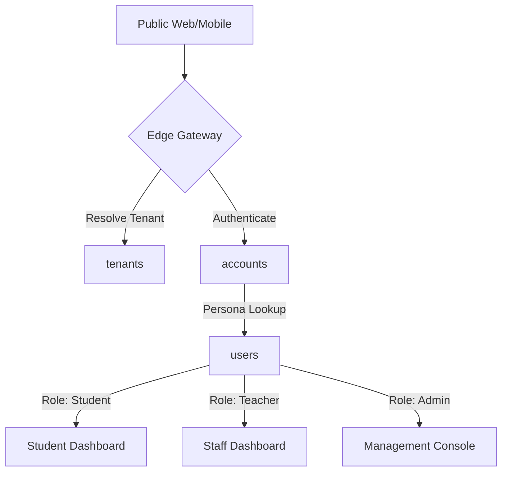

# Core Domain Architecture

## Overview
The Core domain is the foundation of the EdApex Planet-Scale Architecture. It manages multi-tenancy (Tenants), the separation of platform identity from school-level personas (Accounts & Users), and the temporal context (Academic Years). It provides the "Hull" within which all other domain modules operate.

### Key Business Logic
- **Tenant Hull Design**: Every school/campus is a standalone tenant. All data is logically isolated via `tenantId`.
- **Identity vs. Persona**: Platform identity (`accounts`) is decoupled from domain personas (`users`). This allows for unified authentication while supporting multiple roles (Student, Staff, Parent) per user.
- **Academic Context**: All academic operations are scoped to an `academicYearId`, ensuring historical data integrity and session-based logic.

---

## Entity Mapping (V1 -> V2)

| Legacy Table (`schoolify`) | V2 Entity (`src/db/domain-core.ts`) | Notes |
| :--- | :--- | :--- |
| `sm_schools` | `tenants` | Centrally managed school entities. |
| `users` | `accounts` / `auth_accounts` | Better-Auth identity layer and OAuth linkages. |
| `users` (Roles/Personas)| `users` | Domain-specific personas (Student, Staff, Parent). |
| `sm_academic_years` | `academicYears` | Temporal session control. |
| `sm_base_setups` | `enumerations` | Centralized taxonomy mapping (Gender, Blood Group, etc.). |

---

## AI Agent & Tool Integration

### Task Agents
- **Identity Provisioner**: Manages the creation of accounts and the linking of personas based on roles.
- **Tenant Architect**: Handles the initialization of new tenants, branding set-up, and module enablement.

### Multi-Agent Tools
- `provision_account.tool`: Creates platform-level `accounts` and initiates `users` personas.
- `resolve_tenant_context.tool`: Injects `tenantId` and `academicId` into request lifecycles.
- `manage_enumerations.tool`: Handles global vs tenant-specific taxonomy.

---

## PBAC & Security

### Policy Enforcement
- **Tenant Isolation**: Every query is implicitly filtered by `tenantId`. A `SchoolAdmin` can only access accounts and users where `tenantId` matches their signed-in context.
- **Identity Separation**: Users cannot access platform-level `accounts` metadata (like `stripeId`) unless they have `SystemAdmin` privileges.
- **Self-Service**: Students/Parents can only read/update their specific persona `metadata` in the `users` table.

---

## Recommendations & Justifications

### 1. Tenant-Level Feature Flags
**Proposal**: Introduce a `tenant_features` entity or extend `tenants.metadata` to store active modules.
- **Justification**: Replaces the legacy `ModulePermissionMiddleware` check (`isModuleForSchool`). This allows for dynamic, subscription-tier-based feature enablement at the Edge.

### 2. Multi-Persona Linking
**Proposal**: Formalize the link between a single `account` and multiple `users` personas across different tenants.
- **Justification**: Currently, `accounts` table contains `tenant_id`. To support a true "Platform User" who might be a teacher in School A and a parent in School B, the `tenant_id` should move from `accounts` to a junction table or solely reside in the `users` table.

### 3. Enumeration Scoping
**Proposal**: Ensure `enumerations` strictly follow the `tenantId = NULL` for global defaults and `tenantId = ID` for tenant-specific overrides.
- **Justification**: Allows schools to define custom categories (e.g., custom Student Categories) without polluting the global taxonomy.

---

## Identity Workflow Diagram


---

## Hono API Routes

```
Routes → CoreController → CoreService → CoreRepository → tenants/accounts/users
```

| Method | Route | Description | Auth |
|:---|:---|:---|:---|
| `GET/POST` | `/api/auth/*` | Better-Auth framework endpoints (login, register, session) | Public |
| `GET` | `/api/v1/tenants` | List tenants (system admin only) | `SystemAdmin` |
| `POST` | `/api/v1/tenants` | Create tenant | `SystemAdmin` |
| `GET` | `/api/v1/tenants/:id` | Get tenant details | `TenantAdmin` |
| `PATCH` | `/api/v1/tenants/:id` | Update tenant metadata | `TenantAdmin` |
| `GET` | `/api/v1/users` | List users (filtered by persona type) | `TenantAdmin` |
| `POST` | `/api/v1/users` | Create user persona | `TenantAdmin` |
| `GET` | `/api/v1/users/:id` | Get user details | Self + `TenantAdmin` |
| `PATCH` | `/api/v1/users/:id` | Update user metadata | Self + `TenantAdmin` |
| `GET` | `/api/v1/academic-years` | List academic years | Authenticated |
| `POST` | `/api/v1/academic-years` | Create academic year | `TenantAdmin` |
| `GET` | `/api/v1/enumerations` | List enums by domain | Authenticated |

---

## HMAS Agent Registry

| Agent | Type | Capabilities |
|:---|:---|:---|
| `identity_provisioner` | Task | Account creation, persona linking, onboarding |
| `tenant_architect` | Task | Tenant initialization, branding, module enablement |
| `context_resolver` | Task | Injects tenantId + academicId into request |

---

## Domain Events

| Event | Payload | Consumers |
|:---|:---|:---|
| `core.tenant_provisioned` | `{ tenantId, name, tier }` | Settings (default config), PBAC (default policies) |
| `core.user_created` | `{ userId, tenantId, userType }` | Communication (welcome message), PBAC (default role) |
| `core.account_linked` | `{ accountId, userId, tenantId }` | Events (audit) |
| `core.academic_year_activated` | `{ academicId, tenantId }` | All domains (context switch) |

