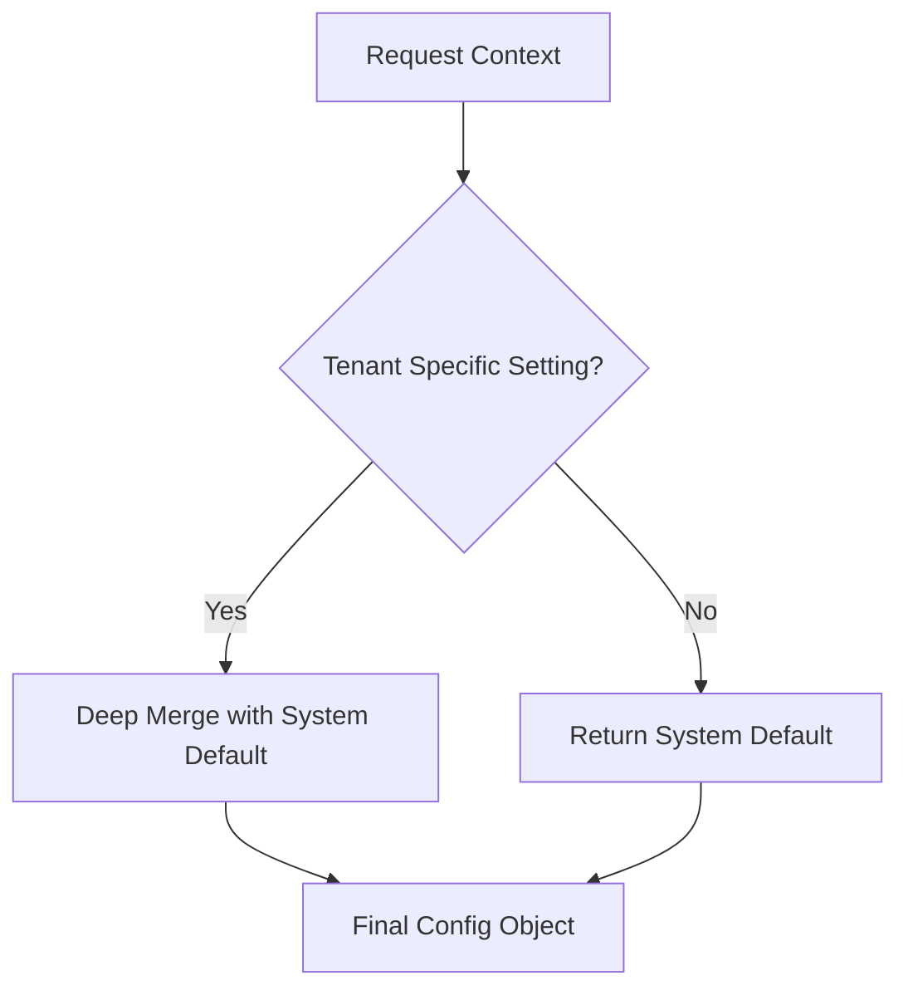

# Domain Architecture: Settings

## 1. Domain Overview
The **Settings** domain in EdApex V2 centralizes all system and tenant-level configurations. It replaces the legacy flat-table approach with a polymorphic, JSON-driven storage model that supports planet-scale multi-tenancy and dynamic feature toggeling.

### Key Logic
- **Decoupled Configuration**: All toggles (e.g., "Chat Enabled", "LMS Active") are moved from hardcoded columns to a flexible `config` JSON field.
- **Categorization**: Settings are grouped by `domain` (e.g., `general`, `finance`, `ai`, `features`) to optimize lookup and caching.
- **Tenant Isolation**: Every setting is scoped to a `tenant_id`, ensuring no cross-tenant leakage of configuration or credentials.

## 2. Entity Mapping (V1 -> V2)

### General Settings
| Legacy Table (`sm_general_settings`) | V2 Entity (`settings`) | Transformation Logic |
| :--- | :--- | :--- |
| `school_name` | `config.schoolName` | Extracted into `domain='general'`. |
| `logo` / `favicon` | `config.logo` / `config.favicon` | Stored as relative paths in JSON. |
| `address` / `phone` / `email` | `config.address` / `config.phone` / etc. | Consolidated into general identity metadata. |
| `currency` / `currency_symbol` | `config.currency` / `config.symbol` | Extracted into `domain='finance'`. |
| `session_id` | `config.sessionId` | Maps to the active session in `domain='general'`. |

### Module & Feature Management
| Legacy Table (`sm_modules`) | V2 Entity (`settings`) | Transformation Logic |
| :--- | :--- | :--- |
| `name` | `domain='features' -> config.featureKey` | Modules are now treated as feature flags. |
| `active_status` | `config.enabled` | Boolean toggle in feature flag metadata. |

## 3. Configuration Hierarchy & Overrides
To support global defaults with tenant-specific overrides, EdApex V2 implements a **Fallback Mechanism**.

### Hierarchy Logic
1.  **System Default**: A "Global" configuration record (reserved `tenant_id = 1` or a system-level seed).
2.  **Tenant Override**: A record matching the current `tenant_id`.
3.  **Resolution**: The `SettingsService` performs a `deepMerge(SystemDefault, TenantOverride)`.



## 4. Feature Flag Architecture
For planet-scale deployment, EdApex V2 uses a "Feature Flag" domain within the `settings` table to control functionality without deployments.

### Feature Flag DSL
```typescript
interface FeatureFlag {
  enabled: boolean;
  rolloutPercentage?: number; // 0-100 for staggered release
  targetAudiences?: string[]; // ["beta_testers", "internal_staff"]
  activeDates?: { from: string; to: string };
}
```

### Justification
- **Scalability**: Feature flags are cached at the Edge (Redis/KV Store) to prevent database round-trips for authorization and layout decisions.
- **Stability**: Allows "Dark Launching" new services (like AI-Modules) to specific tenants safely.

## 5. PBAC & Security
Access to the Settings domain is strictly controlled to prevent unauthorized configuration changes.

- **System Admin**: Full access to all `tenant_id` settings and System Defaults.
- **Tenant Admin**: Access limited to their own `tenant_id`.
- **Read-Only**: Service accounts (Agents) can only read specific domains (e.g., `ai_supervisor` reading `domain='ai'`).

## 6. Recommendations & Justifications

### 1. Separate `system_settings` from `tenant_settings`
**Current Implementation**: `settings.tenant_id` is `notNull()`.
**Proposal**: Allow `tenant_id` to be NULL for system-wide defaults.
**Justification**: Simplifies the lookup logic. If `tenant_id = ?` returns no results, the engine automatically falls back to `tenant_id IS NULL`.

### 2. Add `version` to `SettingConfig`
**Current Implementation**: No explicit versioning in JSON.
**Proposal**: Add a `version` field to every `config` object.
**Justification**: Supports seamless schema migrations of the JSON payloads as new features are added to modules.
```json
{
  "domain": "general",
  "config": {
    "version": "1.0.0",
    "schoolName": "Greenwood Academy",
    "...": "..."
  }
}
```

---

## Hono API Routes

```
Routes → SettingsController → SettingsService → SettingsRepository → settings/featureFlags
```

| Method | Route | Description | Auth |
|:---|:---|:---|:---|
| `GET` | `/api/v1/settings` | List settings by domain | `TenantAdmin` |
| `GET` | `/api/v1/settings/:domain` | Get specific domain config | Authenticated |
| `PUT` | `/api/v1/settings/:domain` | Upsert domain config | `TenantAdmin` |
| `GET` | `/api/v1/feature-flags` | List feature flags | `TenantAdmin` |
| `POST` | `/api/v1/feature-flags` | Create feature flag | `TenantAdmin` |
| `PATCH` | `/api/v1/feature-flags/:id` | Toggle flag / update rollout | `TenantAdmin` |
| `GET` | `/api/v1/feature-flags/evaluate/:key` | Evaluate flag for current user | Authenticated |

---

## HMAS Agent Registry

| Agent | Type | Capabilities |
|:---|:---|:---|
| `config_provisioner` | Task | Seeds default settings on tenant creation |
| `feature_evaluator` | Task | Evaluates feature flag with rollout % and user targeting |

---

## Domain Events

| Event | Payload | Consumers |
|:---|:---|:---|
| `settings.config_updated` | `{ tenantId, domain, changedKeys[] }` | Events (audit), affected domains (cache invalidation) |
| `settings.feature_toggled` | `{ tenantId, featureKey, isEnabled }` | Events (audit), All domains (module enablement) |
